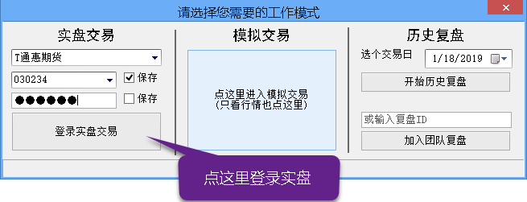
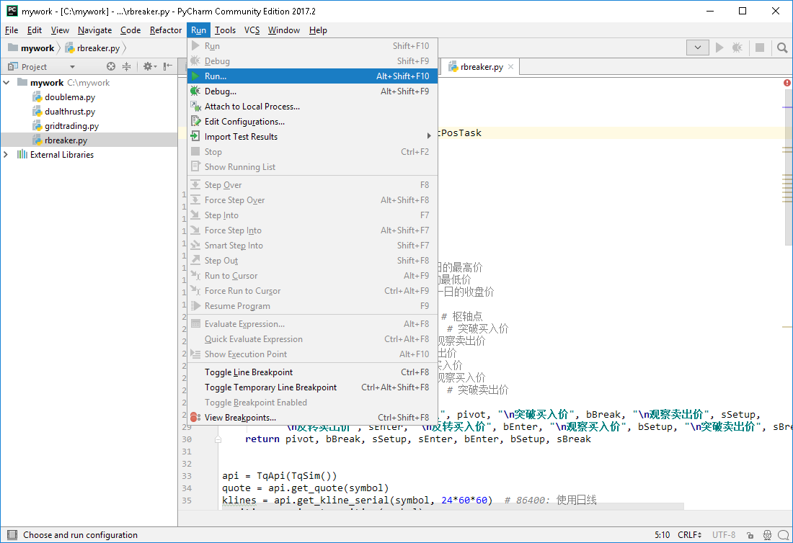
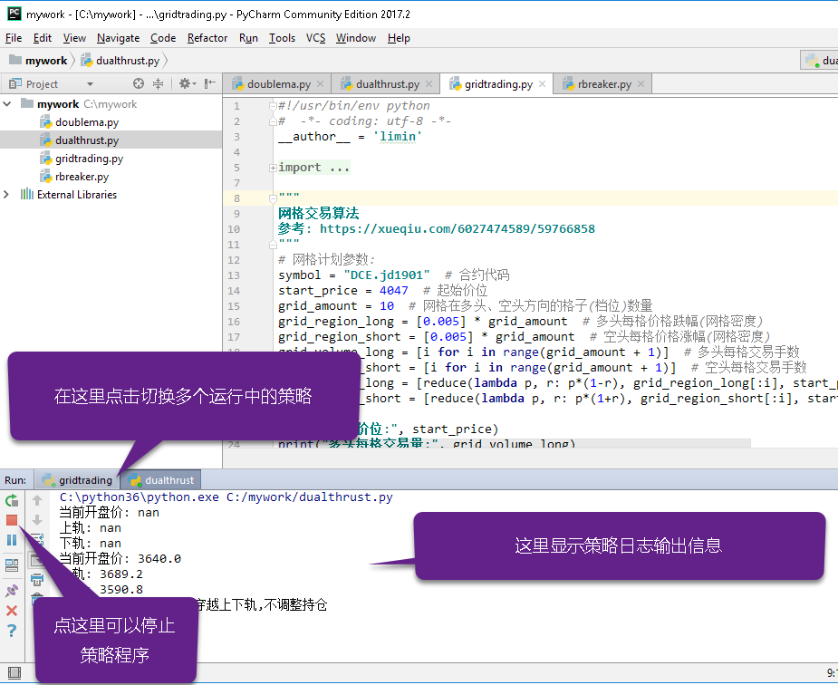
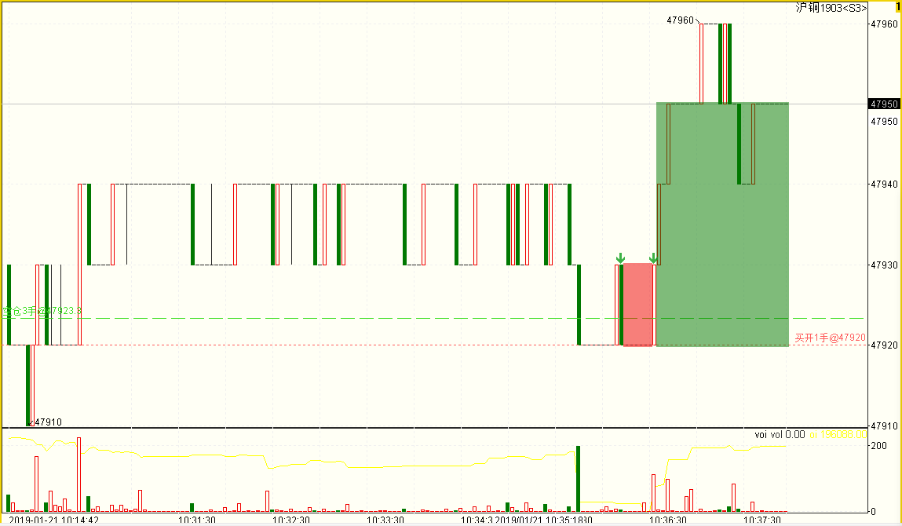
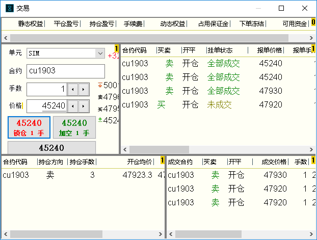
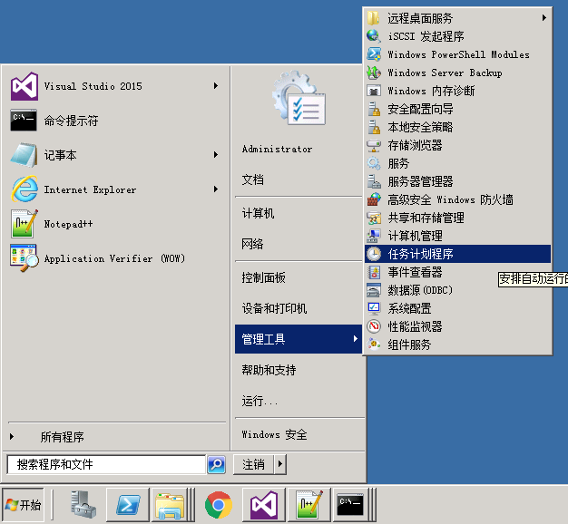
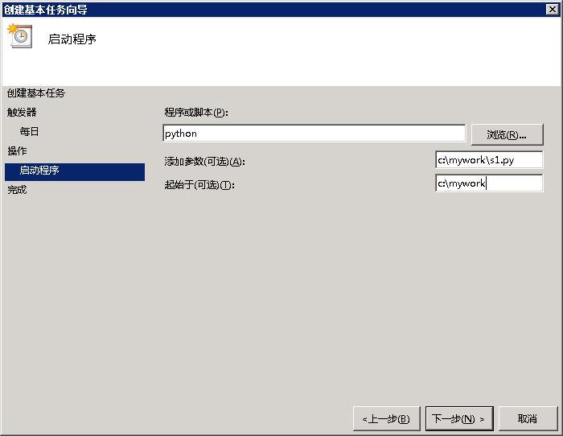
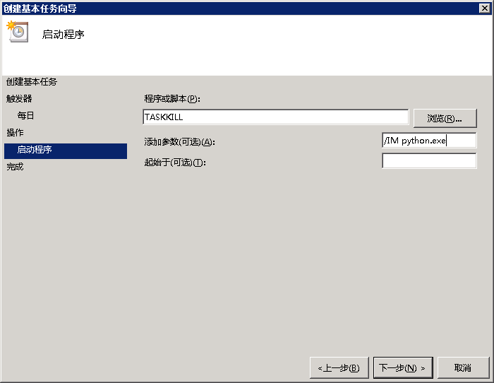
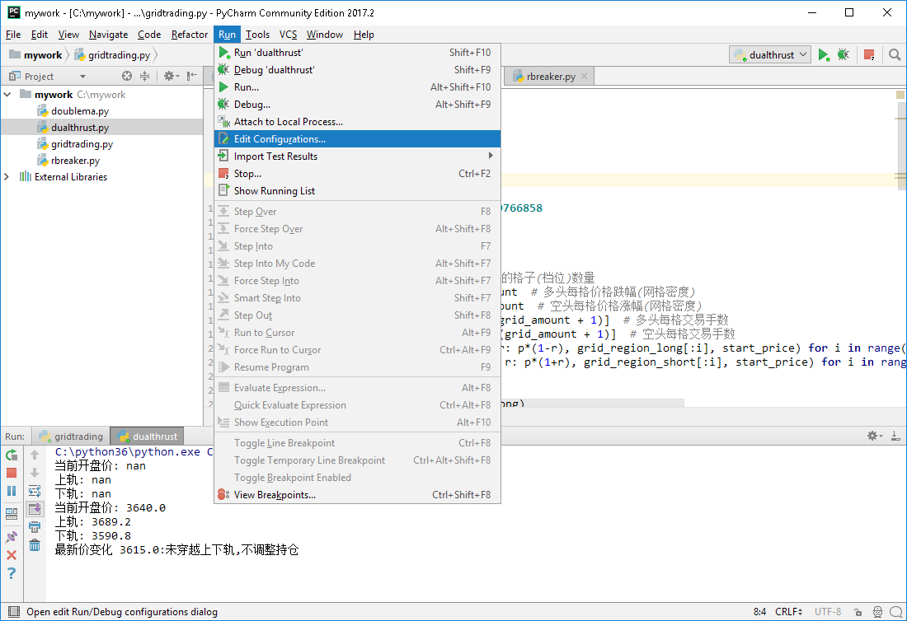
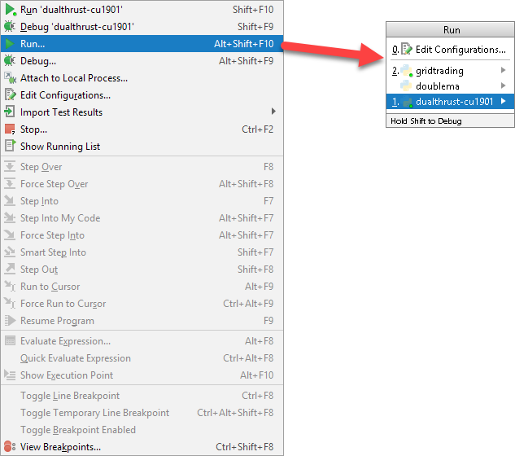

实盘交易最佳实践
=================================================
TqSdk可以被用于实盘交易. 我们针对有人值守和无人值守两种应用场景, 分别提供一套最佳实践方案. 遵循这些方案, 可以简化您的策略运行管理工作, 并减少运行风险.

在有人监控环境下执行策略
-------------------------------------------------
一般情况下, 刚开发好的策略程序, 都是在有人监控环境下投入实盘运行. 

环境准备
~~~~~~~~~~~~~~~~~~~~~~~~~~~~~~~~~~~~~~~~~~~~~~~~~
您首先需要准备一台 windows 电脑, 并保证有稳定的宽带连接. 以下是我们的一些建议:

* 确保一定水准的硬件配置(至少2核以上CPU, 4G以上内存, SSD硬盘)
* 不安装与运行策略代码无关的任何软件 (包括杀毒软件/QQ/输入法/浏览器等)
* 安装所有windows安全补丁, 并允许自动更新, 把自动更新时间设置在周末
* 如果你的电脑是在云服务器上运行, 请尽量关闭各种无关服务和端口

一旦您的电脑准备好, 请安装以下软件:

* `Python3.6 以上版本 <https://www.python.org/downloads/windows/>`_  (32位或64位均可) 
* :ref:`TqSdk <install>`
* :ref:`天勤终端 <tq>`
* `Pycharm Community <https://www.jetbrains.com/pycharm/download/#section=windows>`_

创建一个目录, 放置你所有的策略文件. 

启动 pycharm, 打开你的策略文件目录. 双击打开目录中的每个策略

.. image:: ../images/pycharm_open_directory.png

设置每个策略程序连接到天勤终端
~~~~~~~~~~~~~~~~~~~~~~~~~~~~~~~~~~~~~~~~~~~~~~~~~
您需要在python代码中, 将每个策略程序配置为连接到天勤终端. 在创建 TqApi 时, 传入实盘账号字符串. 注意: 这里不需要填写期货公司和账号密码::

  api = TqApi("030234")

每日运行 - 启动
~~~~~~~~~~~~~~~~~~~~~~~~~~~~~~~~~~~~~~~~~~~~~~~~~
在每日开盘时, 执行以下动作:

* 打开天勤终端, 登录实盘账户, 确定登录成功, 账户信息显示无误. 注意: 登录的实盘账号必须与py文件中写的完全一致

* 逐个点击每个策略文件, 点run运行

   策略运行中, 通过 pycharm 日志窗口监控策略日志输出.

每日运行 - 监控及异常处理
~~~~~~~~~~~~~~~~~~~~~~~~~~~~~~~~~~~~~~~~~~~~~~~~~
在策略运行过程中, 使用 pycharm 日志窗口监控策略运行日志, 同时通过天勤终端监控策略报单和持仓.

   在天勤的图表上看交易委托记录.

   

   在天勤的交易表格中监控报单和持仓.

在运行过程中, 如果发现策略运行异常, 应该先停止策略运行, 再手工调整委托单和持仓

策略代码修改完毕后, 重新运行策略程序

每日运行 - 收盘处理
~~~~~~~~~~~~~~~~~~~~~~~~~~~~~~~~~~~~~~~~~~~~~~~~~
每日收盘后, 按以下顺序关闭系统:

* pycharm中对每个运行的策略点stop, 停止策略运行
* 关闭天勤终端

  
在无人监控环境下执行策略
-------------------------------------------------
对于已经过充分测试, 十分成熟的策略程序, 也可以选择以无人值守方式运行. 

准备环境
~~~~~~~~~~~~~~~~~~~~~~~~~~~~~~~~~~~~~~~~~~~~~~~~~
TqSdk可以在windows/linux或macosx环境下运行. 无论您选择使用windows或linux系统, 请确保

* 已经装有 Python 3.6+
* 安装 :ref:`TqSdk <install>`

创建一个目录, 放置你所有的策略文件. 

在每个策略程序中设置实盘账号
~~~~~~~~~~~~~~~~~~~~~~~~~~~~~~~~~~~~~~~~~~~~~~~~~
将每个策略程序配置为独立直连实盘账号. 在创建 TqApi 时, 传入TqAccount实例. 注意期货公司名称需要与天勤中的名称一致::

  api = TqApi(TqAccount("H海通期货", "022631", "123456"))

检查策略程序
~~~~~~~~~~~~~~~~~~~~~~~~~~~~~~~~~~~~~~~~~~~~~~~~~
将策略代码投入无人监控运行前, 除对策略代码进行全面测试外, 还应注意以下事项:

* 使用 python 的 logging 模块输出日志信息到文件, 不要使用 print 打印日志信息
* 策略代码退出时记得调用 api.close() 函数, 或者用 with closing(api) 的格式确保退出时自动关闭
* 目前api在运行过程中抛出的异常, 默认处理都是整个策略进程直接退出. 如无特殊需求, 不要使用 expect: 的方式捕获异常并阻止程序退出, 这种情况如果没有正确处理, 可能产生难以预测的后果.

在 windows 环境下配置策略的定时启动/停止
~~~~~~~~~~~~~~~~~~~~~~~~~~~~~~~~~~~~~~~~~~~~~~~~~
在 windows 下, 通常使用计划任务来管理策略的定时启动/停止, 下面的说明以 Windows Server 2008 为例, 其它 windows 版本操作可能有少许差异.

打开 windows 任务计划管理器

为每个策略添加一个策略启动任务, [程序或脚本]处填 python.exe, [添加参数]处填策略代码py文件名和参数, [起始于]处填策略代码目录

最后添加一个任务, 用来停止所有策略进程. [程序或脚本]处填 taskkill, [添加参数]处填 /IM python.exe

在 linux 环境下配置策略的定时启动/停止
~~~~~~~~~~~~~~~~~~~~~~~~~~~~~~~~~~~~~~~~~~~~~~~~~
在 linux 下, 通常使用 cron 服务来处理策略的定时启动/停止. 具体配置请参考您所使用linux发行版的相应文档. 

将一个策略应用于多个合约或多个账户
-------------------------------------------------
将一个策略应用于多个合约或多个账户是一个常见需求. 我们推荐使用 命令行参数 来传递合约或账户信息. 请看下面例子::

  #  -*- coding: utf-8 -*-

  from tqsdk import TqApi, TqSim

  api = TqApi(TqAccount("H海通期货", "0330203", "SHFE.cu1901"))
  # 开仓两手并等待完成
  order = api.insert_order(symbol="SHFE.rb1901", direction="BUY", offset="OPEN", limit_price=4310,volume=2)
  while order["status"] != "FINISHED":
      api.wait_update()
  print("已开仓")

  
上面的代码中固定了账户及合约代码 SHFE.rb1901. 我们可以利用 python 的 argparse 模块为这个程序添加一些参数::

  #  -*- coding: utf-8 -*-

  import argparse
  from tqsdk import TqApi, TqSim, TqAccount

  #解析命令行参数
  parser = argparse.ArgumentParser()
  parser.add_argument('--broker')
  parser.add_argument('--user_name')
  parser.add_argument('--password')
  parser.add_argument('--symbol')
  args = parser.parse_args()
  print("策略参数为: ", args.user_name, args.symbol)

  api = TqApi(TqAccount(args.broker, args.user_name, args.password))
  # 开仓两手并等待完成
  order = api.insert_order(symbol=args.symbol, direction="BUY", offset="OPEN", limit_price=4310,volume=2)
  while order["status"] != "FINISHED":
      api.wait_update()
  print("已开仓")

要通过命令行运行此策略, 可以输入::

  python args.py --broker=H海通期货 --user_name=0330203 --password=123456 --symbol=SHFE.cu1901

要在 PyCharm 中同时执行此程序的多种参数版本, 可以通过 PyCharm 的 Run Configuration 实现.

先在 Edit Configuration 中, 为每组参数创建一个运行项

.. image:: ../images/pycharm_edit_configuration.png

在 Edit Configuration 中配置好以后, 通过 Run... 菜单选择保存好的运行项, 即可实现带参数运行

