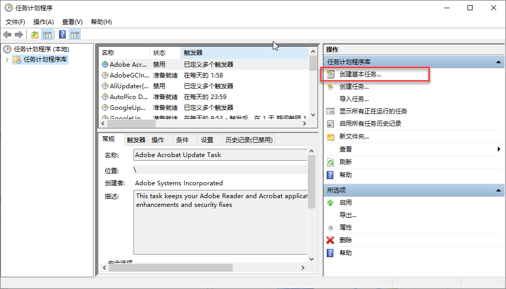
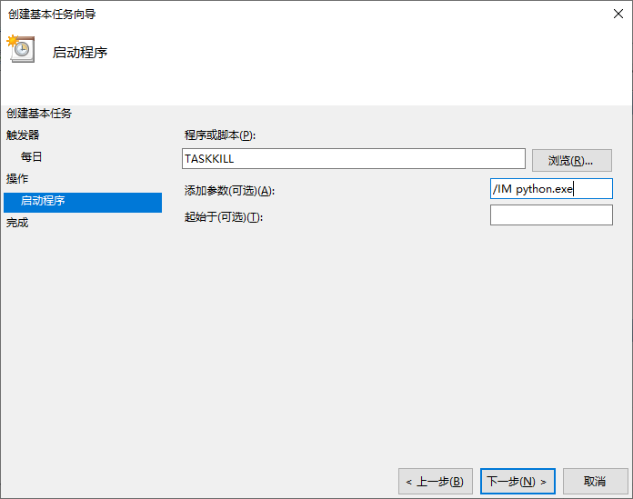
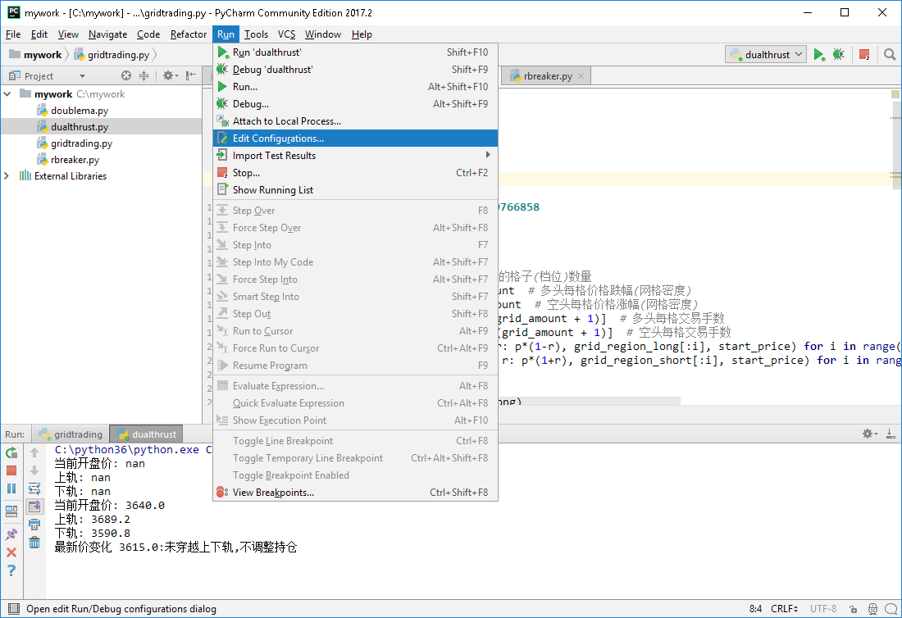
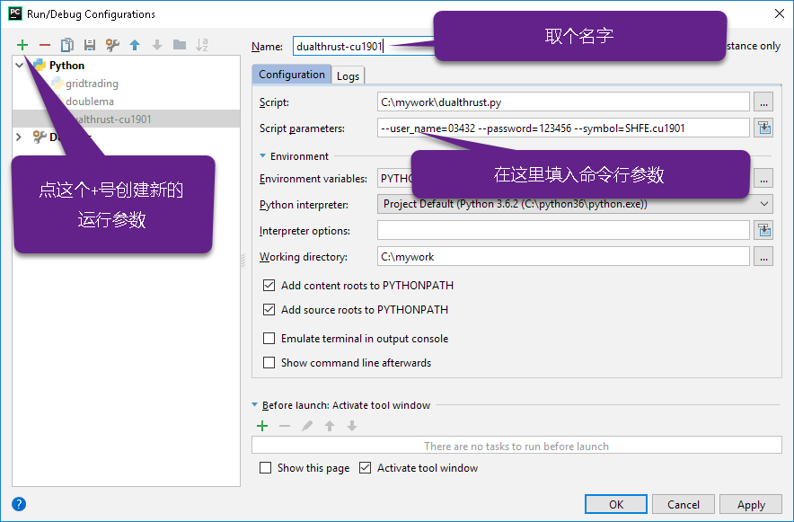
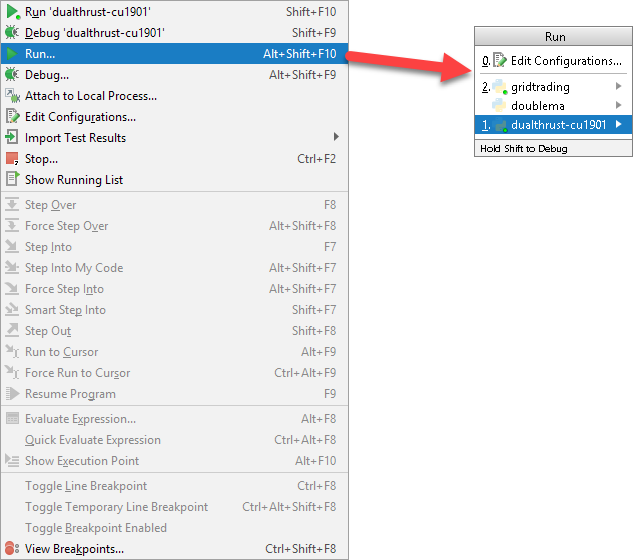

.. _unanttended:

在无人监控环境下执行策略
=================================================
对于已经过充分测试, 十分成熟的策略程序, 也可以选择以无人值守方式运行. 

准备环境
~~~~~~~~~~~~~~~~~~~~~~~~~~~~~~~~~~~~~~~~~~~~~~~~~
TqSdk可以在windows/linux或macosx环境下运行. 无论您选择使用windows或linux系统, 请确保

* 已经装有 Python 3.7+
* 安装 :ref:`TqSdk <tqsdk_install>`

创建一个目录, 放置你所有的策略文件. 

在每个策略程序中设置实盘账号
~~~~~~~~~~~~~~~~~~~~~~~~~~~~~~~~~~~~~~~~~~~~~~~~~
将每个策略程序配置为独立直连实盘账号. 在创建 TqApi 时, 传入TqAccount实例. 注意期货公司名称需要与天勤中的名称一致::

  api = TqApi(TqAccount("H海通期货", "022631", "123456"), auth=TqAuth("快期账户", "账户密码"))

检查策略程序
~~~~~~~~~~~~~~~~~~~~~~~~~~~~~~~~~~~~~~~~~~~~~~~~~
将策略代码投入无人监控运行前, 除对策略代码进行全面测试外, 还应注意以下事项:

* 使用 python 的 logging 模块输出日志信息到文件, 不要使用 print 打印日志信息
* 策略代码退出时记得调用 api.close() 函数, 或者用 with closing(api) 的格式确保退出时自动关闭
* 目前api在运行过程中抛出的异常, 默认处理都是整个策略进程直接退出. 如无特殊需求, 不要使用 expect: 的方式捕获异常并阻止程序退出, 这种情况如果没有正确处理, 可能产生难以预测的后果.

在 windows 环境下配置策略的定时启动/停止
~~~~~~~~~~~~~~~~~~~~~~~~~~~~~~~~~~~~~~~~~~~~~~~~~
在 windows 下, 通常使用计划任务来管理策略的定时启动/停止, 下面的说明以 Windows 10 为例, 其它 windows 版本操作可能有少许差异.

打开 windows 任务计划管理器

.. image:: ../images/win10_start_scheduled_task.png

点击 创建基本任务

为每个策略添加一个策略启动任务, [程序或脚本]处填 python.exe, [添加参数]处填策略代码py文件名和参数, [起始于]处填策略代码目录

最后添加一个任务, 用来停止所有策略进程. [程序或脚本]处填 taskkill, [添加参数]处填 /IM python.exe

在 linux 环境下配置策略的定时启动/停止
~~~~~~~~~~~~~~~~~~~~~~~~~~~~~~~~~~~~~~~~~~~~~~~~~
在 linux 下, 通常使用 cron 服务来处理策略的定时启动/停止. 具体配置请参考您所使用linux发行版的相应文档. 

将一个策略应用于多个合约或多个账户
-------------------------------------------------
将一个策略应用于多个合约或多个账户是一个常见需求. 我们推荐使用 命令行参数 来传递合约或账户信息. 请看下面例子::

  #  -*- coding: utf-8 -*-

  from tqsdk import TqApi, TqAccount

  api = TqApi(TqAccount("H海通期货", "0330203", "123456"), auth=TqAuth("快期账户", "账户密码"))
  # 开仓两手并等待完成
  order = api.insert_order(symbol="SHFE.rb1901", direction="BUY", offset="OPEN", limit_price=4310,volume=2)
  while order.status != "FINISHED":
      api.wait_update()
  print("已开仓")

  
上面的代码中固定了账户及合约代码 SHFE.rb1901. 我们可以利用 python 的 argparse 模块为这个程序添加一些参数::

  #  -*- coding: utf-8 -*-

  import argparse
  from tqsdk import TqApi, TqSim, TqAccount

  #解析命令行参数
  parser = argparse.ArgumentParser()
  parser.add_argument('--broker')
  parser.add_argument('--user_name')
  parser.add_argument('--password')
  parser.add_argument('--symbol')
  args = parser.parse_args()
  print("策略参数为: ", args.user_name, args.symbol)

  api = TqApi(TqAccount(args.broker, args.user_name, args.password), auth=TqAuth("快期账户", "账户密码"))
  # 开仓两手并等待完成
  order = api.insert_order(symbol=args.symbol, direction="BUY", offset="OPEN", limit_price=4310,volume=2)
  while order.status != "FINISHED":
      api.wait_update()
  print("已开仓")

要通过命令行运行此策略, 可以输入::

  python args.py --broker=H海通期货 --user_name=0330203 --password=123456 --symbol=SHFE.cu1901

要在 PyCharm 中同时执行此程序的多种参数版本, 可以通过 PyCharm 的 Run Configuration 实现.

先在 Edit Configuration 中, 为每组参数创建一个运行项

在 Edit Configuration 中配置好以后, 通过 Run... 菜单选择保存好的运行项, 即可实现带参数运行

