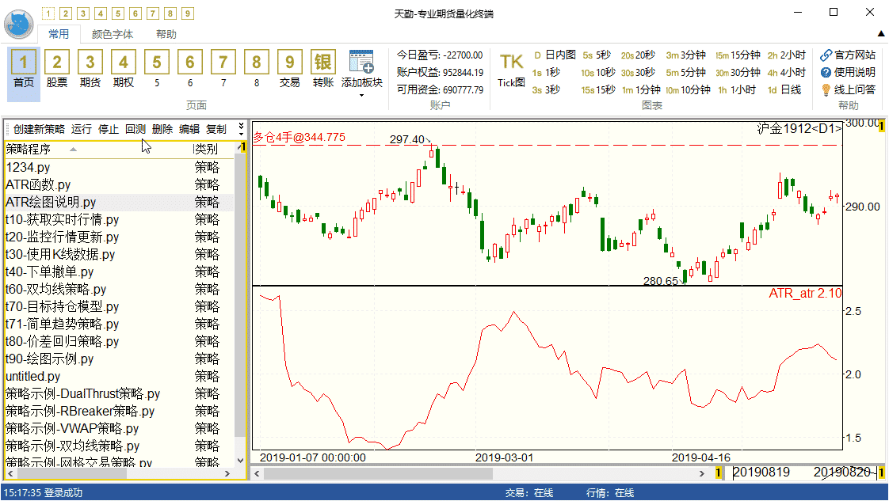
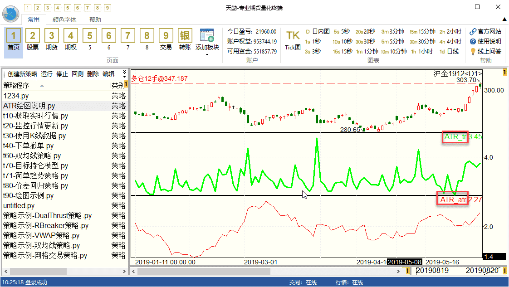

.. _draw_indicator:

技术指标绘图和使用示例
=========================================================================
在TqSdk中我们提供了非常丰富的 :ref:`tqsdk.ta` ，下面我们以真实波幅均值（ATR average true range）为例，来讲解这个指标在策略中如何使用并在天勤终端和VS code插件版中进行画图

ATR的计算比较简单，首先我们要算出当前真实的波幅.这里不单单考虑当前的价格波动，同时也要考虑到前一个时间点收盘价和当前开盘价之间的价格缺口.而ATR则是真实波幅一段时间窗口（一般取14天）的简单移动平均.计算公式如下：

1.真实波幅（TR）： TR = MAX（∣最高价-最低价∣，∣最高价-昨收∣，∣昨收-最低价∣）

2.真实波幅均值（ATR）： ATR = TR的N日简单移动平均

在天勤中我们可以很方便的计算出以上两个数据::

    # 获取 SHFE.au1912 合约的平均真实波幅，导入TqApi和对应的技术指标函数ATR
    from tqsdk import TqApi, TqAuth
    from tqsdk.ta import ATR

    api = TqApi(TqAuth("快期账户", "账户密码"))
    klines = api.get_kline_serial("SHFE.au1912", 24 * 60 * 60)
    atr = ATR(klines, 14)
    print(atr.tr)  # 真实波幅
    print(atr.atr)  # 真实波幅均值
    # 预计的输出是这样的:
    [..., 143.0, 48.0, 80.0, ...]
    [..., 95.20000000000005, 92.0571428571429, 95.21428571428575, ...]
    # 通过api.wait_update()将vs code信息发送给天勤终端
    api.wait_update()
    api.close()
	
如何在天勤终端和外部天勤IDE插件进行绘图？
--------------------------------------------------------------------------
在得到这两个数据之后，我们可使用天勤终端内配置的IDE或 Vs Code插件版来进行绘图::

    # 创建副图以折线显示art.art数据 
    klines["ATR_atr"] = atr.atr
    # ATR_atr.board为选择图版，可选，缺省为"MAIN"表示绘制在主图 
    klines["ATR_atr.board"] = "ATR_atr"
    # 通过api.wait_update()将vs code信息发送给天勤终端
    api.wait_update()
    api.close()
	
以上代码运行之后，会在天勤内部绘制额外atr.atr副图

设定color和width对应可选参数即可更改副图图像颜色和宽度属性::

    # 在副图以折线形态显示atr.tr数据
    klines["ATR_tr"] = atr.tr
    # ATR_tr.board为选择图版，可选，缺省为"MAIN"表示绘制在主图
    klines["ATR_tr.board"] = "ATR_tr"
    # ATR_tr.color为文本颜色，可选，缺省为红色
    klines["ATR_tr.color"] = 0xFF00FF00
    # ATR_tr.width 为折线宽度，可选
    klines["ATR_tr.width"] = 3
    # 创建另外副图显示art.art数据
    klines["ATR_atr"] = atr.atr
    klines["ATR_atr.board"] = "ATR_atr"
    # 通过api.wait_update()将vs code信息发送给天勤终端
    api.wait_update()
    api.close()

运行代码显示如下：

更多的画图示例在示例程序 t90 - t95 ： :ref:`demo`