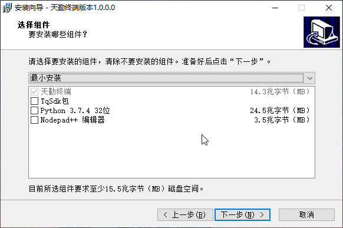
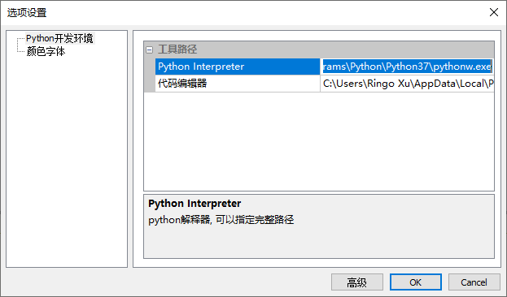
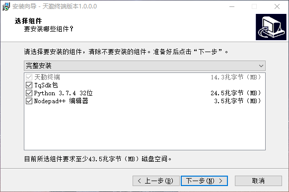
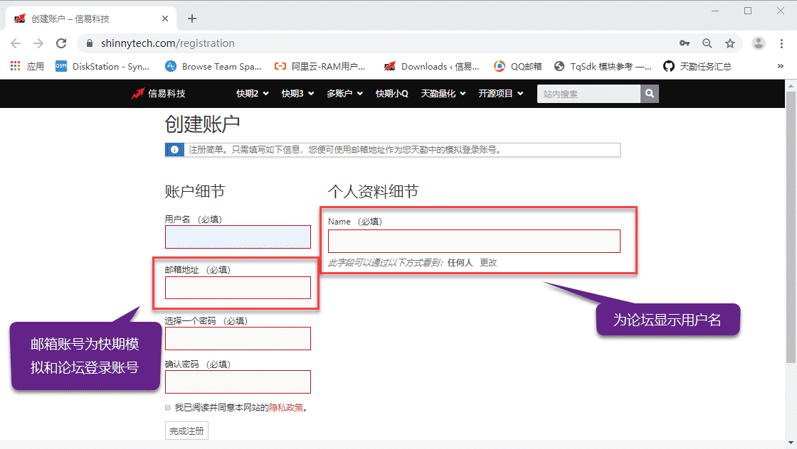

.. _tq_quickstart:

下载天勤终端
=========================================================================
天勤终端目前只支持 Windows 操作系统。要安装天勤软件，请点击 `天勤终端 <https://www.shinnytech.com/?smd_process_download=1&download_id=4279>`_ 下载

下载完毕后，双击安装包进行安装。

在安装过程中可以根据您的需求选择【最小安装】，【完整安装】或【自定义安装】

最小安装
--------------------------------------------------------------------------
【最小安装】为使用天勤终端的推荐方案

安装完成之后，建议配置天勤终端的python环境和IDE，方便终端使用，其中python环境需要安装TqSdk安装包

具体配置步骤如下

● 点击终端【选项】按钮

● 配置对应的python路径和IDE路径,注意配置为pythonw.exe文件

完整安装
--------------------------------------------------------------------------
【完全安装】仅推荐用户电脑上无python环境下选择，存在python环境后选择该方案可能干扰之前的配置环境

选择【完整安装】，会默认帮助用户配置python环境，安装TqSdk开发包等，配置Nodepad++,

此方案下的天勤终端无需再额外配置即可进行策略编辑，

注册模拟账号
--------------------------------------------------------------------------
点击 `【申请模拟账号】 <https://www.shinnytech.com/registration>`_ 后，会自动打开【天勤量化】注册页，填写以下对应信息之后，并点击激活邮件，即可用【邮箱地址】登录天勤终端【快期模拟】和用户论坛

同时【快期模拟】，也可以在TqSdk中通过TqAccount函数进行登录，具体请参照 :ref:`real_trading`
