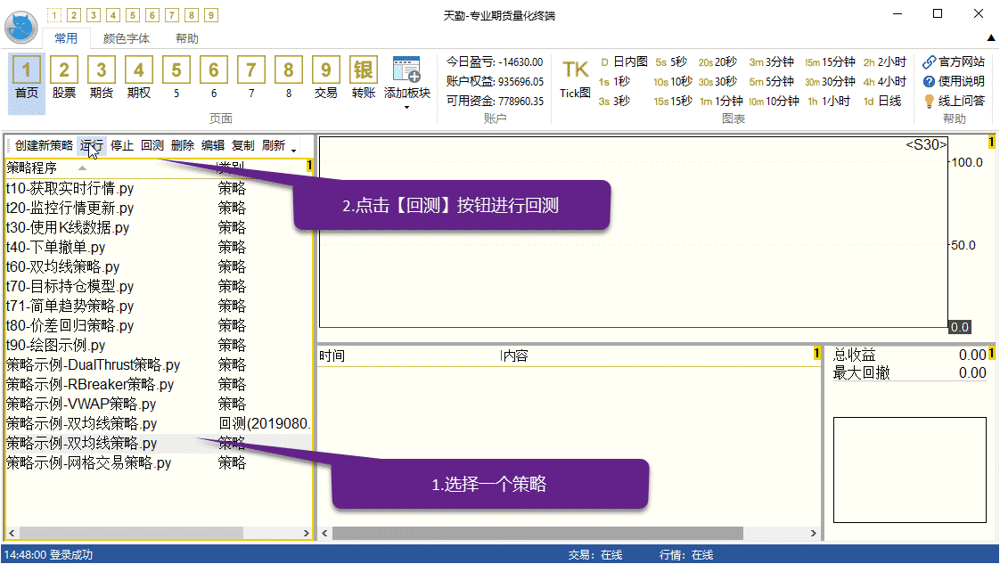
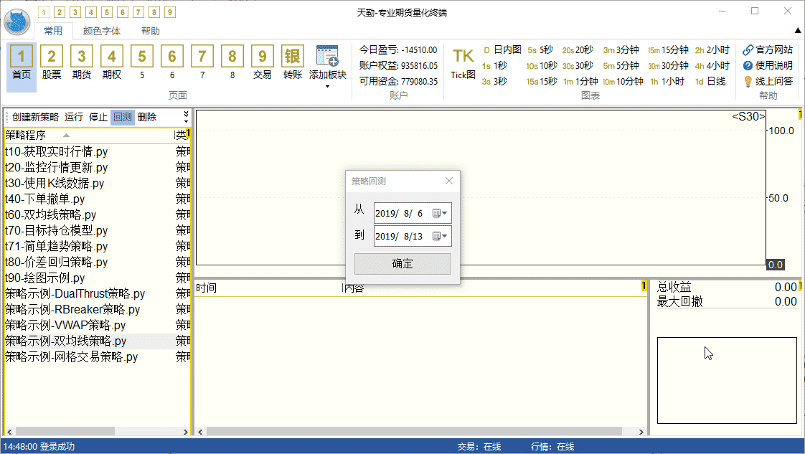
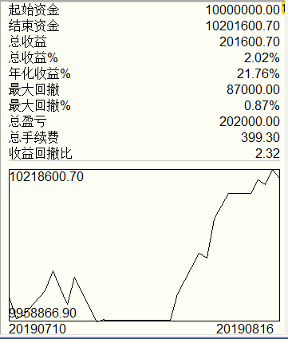
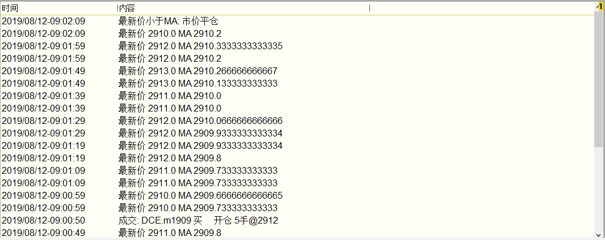
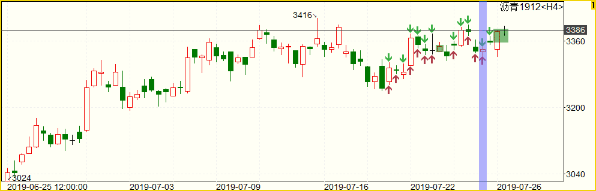

.. _strategybacktest:

终端策略回测
=========================================================================
在天勤终端，我们提供了便捷的方法让大家能够便捷的进行回测，【首页】左侧为回测运行管理区

点击【回测】后，会出现一个弹出框, 让你填写具体回测区间

回测时间输入完毕，然后点击【确定】做到这一步, 策略程序就正式执行回测了

要停止一个执行中的回测, 只需双击它. 再次双击, 会从头开始重新回测  

回测结果
-------------------------------------------------------------------------
天勤的回测报告, 是在整个回测过程中不断更新的

策略报告
-------------------------------------------------------------------------
策略报告展示策略程序回测的收益情况和资金曲线, 如下

策略日志
-------------------------------------------------------------------------
策略程序中用 print 或 logging 输出的信息, 都会出现在这里

策略交易图
-------------------------------------------------------------------------
策略交易图展示一个合约的交易和持仓情况

它包含了这些内容

● 成交记录: 图上用红色和绿色的箭头标注实际发生的成交时间和成交价格

● 持仓记录: 当策略在一段时间内有持仓时, 图上会用红绿色矩形框表示. 红色框表示这段时间的持仓方向与行情方向一致(盈利), 反之为绿色

● 当前挂单: 如果策略当前还有挂单, 将在图上以横线虚线的形式显示

● 当前持仓: 如果策略当前还有持仓, 将在图上以横线实线的形式显示

● 成交记录定位: 如果你在策略日志中选中任意一条日志记录, 图上会用紫色竖条标出这条日志记录的具体时间

如果策略程序交易涉及多个合约, 可以在策略日志中选择一条, 策略交易图将切换到选中的合约

要改变图表K线周期, 请点击菜单右上方对应时间周期

如有需要, 你可以在策略交易图上添加技术指标或者手工画线

再次回测
-------------------------------------------------------------------------
所有运行过的回测结果都会自动保存, 随时可以点击查看

当策略程序修改以后, 如需再次运行回测, 只需对回测任务再次双击即可, 再次回测依然使用前次回测的参数

回测与真实运行有哪些差别
-------------------------------------------------------------------------
我们在设计复盘功能时, 已尽量模仿真实交易的场景. 但由于种种限制, 与实盘运行相比, 回测时在行情和交易方面依然有一些重要的差别

 由于回测时使用模拟交易, 成交情况与实盘交易不可避免地存在一些区别
  ● 模拟交易要求报单价格大于等于对手盘价格才会成交, 例如下买单, 要求价格大于等于卖一价才会成交, 如果不能立即成交则会等到下次行情更新再重新判断
  
 回测模式下 quote 的更新频率由所订阅的 tick 和 k线周期确定
  ● 只要策略程序订阅了tick, 则对应合约的 quote 就会使用 tick 生成, 更新频率也和 tick 一致, 但只有这些字段: datetime/ask&bid_price1/ask&bid_volume1/last_price/highest/lowest/average/volume/amount/open_interest/ price_tick/price_decs/volume_multiple/max&min_limit&market_order_volume/underlying_symbol/strike_price
  
  ● 如果策略程序没有订阅tick, 但是订阅了 k线, 则对应合约的 quote 会使用 k线生成, 更新频率和 k线的周期一致. 如果订阅了某个合约的多个周期的 k线, 则任一个周期的 k线有更新时, quote 都会更新. 使用 k线生成的 quote 的盘口由收盘价分别加/减一个最小变动单位, 并且 highest/lowest/average/amount 始终为 nan, volume 始终为0
  
  ● 如果策略程序既没有订阅tick, 也没有订阅 k线或订阅的k线周期大于分钟线, 则 TqBacktest 会自动订阅分钟线来生成 quote
  
 回测模式下k线会在刚创建出来时和结束时分别更新一次, 在这之间 k线是不会更新的
  
 回测模式下 wait_update 每次最多推进一个行情时间
  
用复盘模式测试策略程序
-------------------------------------------------------------------------
除了回测以外, 你还可以选择用 :ref:`tqreplay` 下的模拟交易来测试你的策略程序

启动天勤复盘模式, 回到过去的某个时间. 详见 :ref:`tqreplay`
按照 :ref:`strategyrun` 的说明, 启动策略运行

