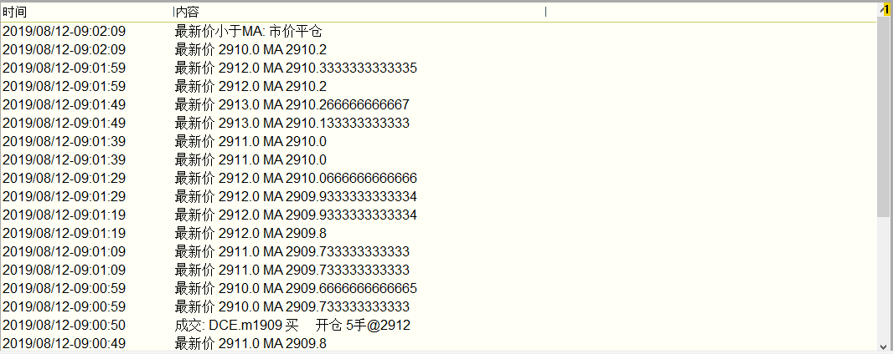

.. _strategyrun:

终端策略运行
=========================================================================
在天勤终端中运行和停止一个策略
-------------------------------------------------------------------------
页面左侧为策略运行管理区 

要创建新策略, 点击 【创建新策略】 按钮. 然后输入新策略文件的文件名：

点击【保存】后，如果您当时选择的是天勤终端全即可在天勤内置的VS Code保存该策略

编辑策略参数
-------------------------------------------------------------------------

如果需要对指定策略进行参数修改，则右键点击需要修改策略，即可修改对应参数，如合约代码等，修改完毕之后点击保存，该策略即可以新参数运行

策略运行监控
-------------------------------------------------------------------------
天勤为策略运行提供全面监控. 在策略运行表中选中任一个策略, 页面会立即显示所选策略的运行情况

策略日志
-------------------------------------------------------------------------
策略程序中用 print 或 logging 输出的信息, 都会出现在这里

策略交易图
-------------------------------------------------------------------------
策略交易图展示一个合约的交易和持仓情况

.. figure:: ../../images/strategy_symbol_image.png

它包含了这些内容

● 成交记录: 图上用红色和绿色的箭头标注实际发生的成交时间和成交价格

● 持仓记录: 当策略在一段时间内有持仓时, 图上会用红绿色矩形框表示. 红色框表示这段时间的持仓方向与行情方向一致(盈利), 反之为绿色

● 当前挂单: 如果策略当前还有挂单, 将在图上以横线虚线的形式显示

● 当前持仓: 如果策略当前还有持仓, 将在图上以横线实线的形式显示

● 成交记录定位: 如果你在策略日志中选中任意一条日志记录, 图上会用紫色竖条标出这条日志记录的具体时间

如果策略程序交易涉及多个合约, 可以在策略日志中选择一条, 策略交易图将切换到选中的合约

要改变图表K线周期, 请点击菜单右上方对应时间周期

如有需要, 你可以在策略交易图上添加技术指标或者手工画线