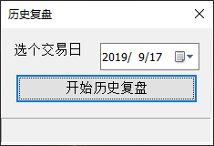
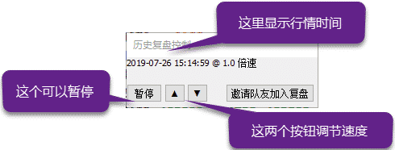

.. _tqreplay:

终端历史复盘
=========================================================================
天勤终端支持全面历史复盘. 您只需指定任一交易日，天勤终端将回到那一天，并完整重演全天的行情变化.在此过程中，您可以如常使用软件全部功能及扩展接口，一切都有如真正回到那天一样，您在回放过程中可以任意暂停或加减速.

使用历史复盘功能
-------------------------------------------------------------------------
欲使用历史复盘功能, 请按以下步骤操作:

● 点击桌面上的 天勤终端-复盘 图标 启动

● 在软件启动时, 先选择一个日期, 然后点击 【开始历史复盘】

● 软件将会以指定的交易日启动, 您可以如常使用软件功能. 复盘状态下默认登录一个 初始资金 100万 的模拟交易账户, 可以进行交易练习.

● 在复盘状态下, 屏幕上将始终有一个悬浮控制框, 可以调整行情回放速度

● 要从复盘状态回到正常使用状态, 请退出软件, 重新启动

