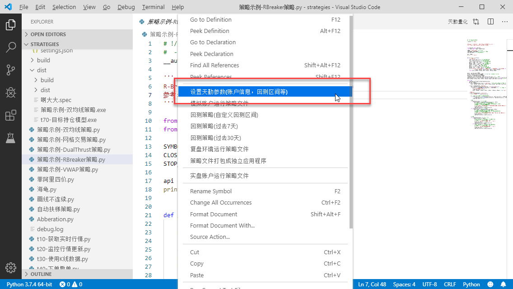
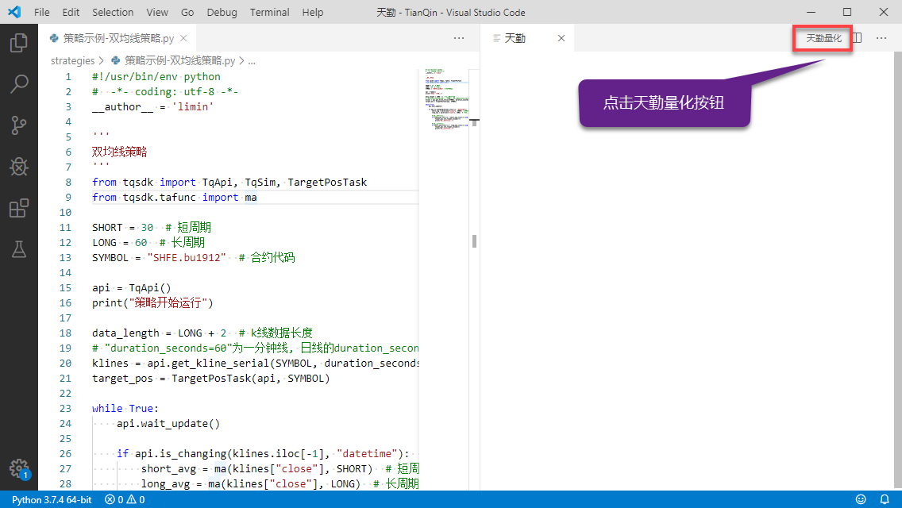
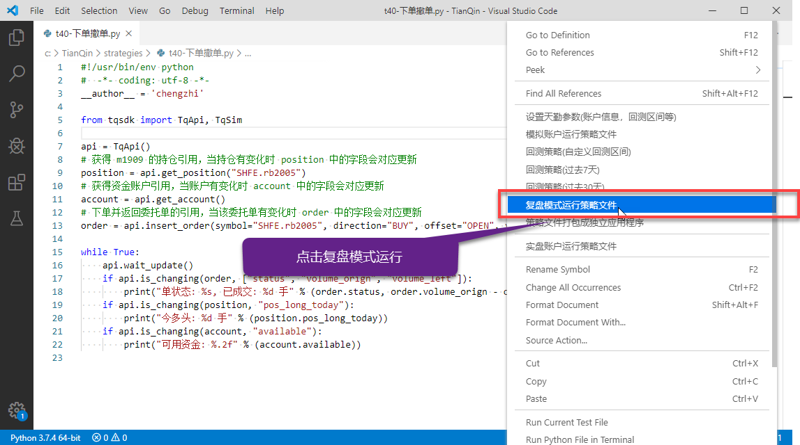
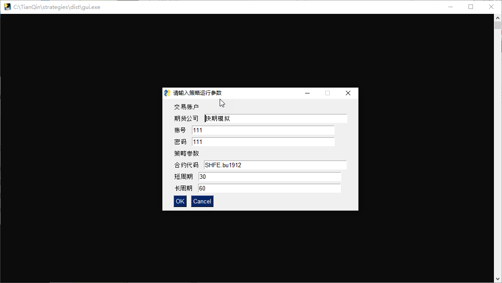

.. _vscode:

天勤 Vs Code 插件
====================================================
天勤 Vs Code插件为在vscode中进行tqsdk相关程序提供一系列便利和支持。它可以帮助您：

* 在策略运行时自动保存日志和成交记录
* 自动显示策略相关合约的K线图
* 一键打包 python 程序为独立可执行程序

安装天勤 Vs Code插件
----------------------------------------------------
在  Vs Code extension 中输入 "天勤量化"或“tqsdk”, 点击【install】按钮，同时第一次使用Vs Code 还需配置安装 “Pyhton” 插件

.. figure:: ../images/vscode_install.png

插件安装好以后, 需要先配置账户参数才能使用,可以右键选项,选择【设置天勤参数】

然后配置如下信息

* 实盘交易账号(选填)
* 快期账号(必填，没有的话可以前往 :ref:`shinny_account` 注册)

配置完毕后，点击菜单栏上的【天勤量化】，将出现一个这样的面板:

祝贺你， Vs Code插件已经安装配置完毕，可以开始使用了, 程序运行后会在右侧自动显示图表

Vs Code插件策略运行
----------------------------------------------------
要运行策略程序，请在策略程序的右键菜单中选择【在实盘中运行】或【在模拟账户中运行】

一旦策略程序开始运行，右侧的天勤面板中将输出策略运行日志。如果策略程序中有绘图输出，也会输出到右侧面板中:

插件会自动保存用户策略的全部报单和print输出信息到硬盘文件，并可在reports目录下随时查看

注意：当右键菜单已经设置了账户信息，但与代码中设置的不一致时，将以右键设置的账户信息为准::

    api = TqApi(TqAccount("快期模拟", "test001@qq.com", "123838"))  # 使用实盘交易账户

当我们使用右键菜单【实盘账户运行策略】时，程序会以菜单中设置的实盘账户运行，而不是代码中的账户

当我们想要停止正在运行/回测的策略时候，我们有两种方法：第一种直接在 Vs Code 下方的 Terminal 按住 Ctrl + C 键，第二种是直接在策略运行/回测时点击 Termial 右上方的垃圾桶键，终止程序运行

Vs Code插件回测策略
----------------------------------------------------
回测功能为 TqSdk 专业版功能，如果需要使用 `可以购买专业版或申请试用 <https://www.shinnytech.com/tqsdk_professional/>`_ ，在获得专业版权限后，设置正确的快期账户，我们即可回测自己的策略

右键菜单中提供默认【回测7天】和【回测30天】

同时我们也提供自定义回测区间功能，右键选择【设置天勤参数】，即可进入设置自定义回测区间

设置成功之后，菜单栏中的【回测策略（自定义回测区间）】即可以刚刚设置的自定义回测区间回测任何策略

回测策略程序时，策略交易记录和日志同样会在天勤面板中输出，同时策略报告图会在右侧显示

.. figure:: ../images/vscode_backtest_report.png

Vs Code插件复盘行情
----------------------------------------------------
在Vs Code中提供和 TqSdk 中一样的复盘功能，首先右键进入天勤参数中选择复盘的具体日期

复盘具体日期选择完毕后，右键选择 【复盘模式运行策略文件】

图形界面上方可以选择暂停，加减速复盘运行

在Vs Code插件中绘图形
--------------------------------------------------------------------------
策略在Vs Code插件版运行时，也可以进行自定义指标绘图，具体操作请参见  :ref:`demo` 中t90——t95

策略程序打包成独立应用程序
----------------------------------------------------
在Vs Code版本中我们提供了一键策略程序打包功能，可以将指定策略程序打包成exe文件，方便用户将自己私人策略打包加密之后提供他人使用

使用策略程序打包功能之前，建议先阅读 :ref:`gui`

以下面代码为例，我们来看看策略程序打包成独立应用程序，具体有什么表现效果

.. literalinclude:: ../../tqsdk/demo/gui/param_input.py
  :language: python
  
首先右键点击【策略程序打包成独立应用程序】

打包完成之后，运行对应exe文件画面显示效果如下

