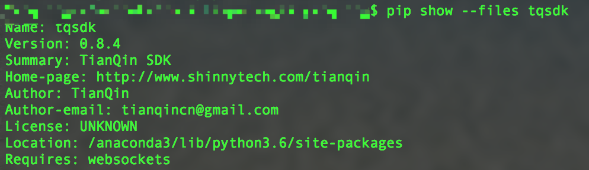

.. _faq:

常见问题
====================================================

.. _faq-prepare:

想使用 TqSdk 必须安装天勤终端吗？
--------------------------------------------------------------------------------------------------------

是的，TqSdk 是配合 **天勤终端** 使用的一套开源 Python 量化交易框架，首先必须安装相应的 **天勤终端** 软件。

* 软件运行环境：Windows 操作系统系统。

* 天勤终端 0.8 以上版本，`天勤客户端下载地址`_ 。

开发交易策略可以在任意的支持 Python 的终端进行。

.. _faq-pip-install-files-location:

运行 `pip install tqsdk` 之后，如何找到安装的文件？
--------------------------------------------------------------------------------------------------------

可以运行以下命令行查看安装包的位置：

.. code-block:: bash

    pip show --files tqsdk

安装包位于 `Location` 位置的 `tqsdk/` 目录下，所有源文件都在这里，`tqsdk/demo/` 下是所有示例文件。

参考链接： `pip文档`_

.. _faq-event-loop-already-running:

运行示例代码后提示 "RuntimeError: Cannot run the event loop while another loop is running"
--------------------------------------------------------------------------------------------------------

TqSdk 使用了 python3 的原生协程和异步通讯库 asyncio，部分 IDE 不支持 asyncio，例如:
 * spyder: 详见 https://github.com/spyder-ide/spyder/issues/7096
 * jupyter: 详见 https://github.com/jupyter/notebook/issues/3397

可以直接运行示例代码(例如: "python demo/t10.py")，或使用支持 asyncio 的 IDE (例如: pycharm)

.. _faq-CLOSE-CLOSETODAY:

关于平今平昨怎么处理？
--------------------------------------------------------------------------------------------------------

+ 直接使用 api.insert_order 下单，在 offset 字段上可以直接指定平今平昨（`CLOSETODAY`/`CLOSE`）。

.. literalinclude:: ../tqsdk/demo/t41.py
    :caption: python demo/t41.py
    :language: python
    :linenos:

+ 使用 TargetPosTask，目标持仓模型下单，通过参数 `offset_priority` 设置平今平昨优先级。

.. literalinclude:: ../tqsdk/demo/t71.py
    :caption: python demo/t71.py
    :language: python
    :linenos:

.. _faq-backtesting:

如何回测策略？
--------------------------------------------------------------------------------------------------------

在创建 TqApi 实例时可以传入 TqBacktest 启用回测功能

.. literalinclude:: ../tqsdk/demo/backtest.py
    :caption: python demo/backtest.py
    :language: python
    :linenos:

网络断线怎么处理？
--------------------------------------------------------------------------------------------------------

在创建 TqApi 实例时可以传入 TqBacktest 启用回测功能

.. literalinclude:: ../tqsdk/demo/backtest.py
    :caption: python demo/backtest.py
    :language: python
    :linenos:

.. _pip文档: https://pip.pypa.io/en/stable/quickstart/
.. _天勤客户端下载地址: http://www.shinnytech.com/tianqin

我想在周末或晚上开发交易程序, 但是行情不跳, 有什么办法么?
--------------------------------------------------------------------------------------------------------
您可以使用天勤终端提供的复盘功能. 请参见: `tq`_ 和 `mdreplay`_

