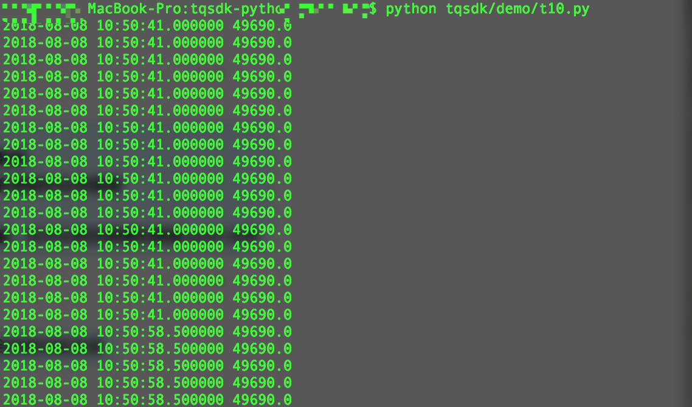

安装
=================================================

1. 天勤终端
-------------------------------------------------

TqSdk 是配合 **天勤终端** 使用的一套开源 Python 量化交易框架，首先必须安装相应的 **天勤终端** 软件。

* 软件运行环境：Windows 操作系统系统。
* 天勤终端 0.8 以上版本，`天勤客户端下载地址`_ 。

2. 量化交易开发环境
-------------------------------------------------

* 操作系统：Windows、 Linux、 MacOS
* Python 3.6 +

.. hint::
   如果开发、运行量化策略不和 **天勤终端** 在同一台电脑上，要确保它们能够互相连通的网络中。

3. 安装 TqSdk 框架
-------------------------------------------------

这里介绍两种不同的方式安装 TqSdk
**************************************************

方式一 通过 `pip` 命令安装
~~~~~~~~~~~~~~~~~~~~~~~~~~~~~~~~~~~~~~~~~~~~~~~~

命令行运行::

    pip install tqsdk

方式二 下载源码安装
~~~~~~~~~~~~~~~~~~~~~~~~~~~~~~~~~~~~~~~~~~~~~~~~

GitHub 下载项目源码后安装::

    git clone https://github.com/shinnytech/tqsdk-python.git

    cd tqsdk-python # 进入项目目录

    python setup.py install

4. 试运行 Demo
-------------------------------------------------

安装完 TqSdk 框架，我们可以运行其中一个示例文件，来确认 TqSdk 框架安装成功。

4.1 首先必须启动天勤终端, 并登录模拟交易。
**************************************************

4.2 针对以上两种不同安装方式，分别介绍两种不同运行方式：
**************************************************

方式一 通过 `pip` 命令安装后
~~~~~~~~~~~~~~~~~~~~~~~~~~~~~~~~~~~~~~~~~~~~~~~~

通过 `pip` 命令安装 TqSdk 框架，同时默认安装了一批示例文件，:ref:`如何找到文件安装位置?<faq-pip-install-files-location>`。

可以直接以系统模块运行：

.. code-block:: bash

    $ python -m tqsdk.demo.t10

.. important::

    默认情况下运行 TqSdk 量化策略和 **天勤终端** 在同一台电脑上。

    实际情况下，您可以从系统安装目录下拷贝出 demo 文件，修改后以下面一种方式运行。

方式二 下载源码安装后
~~~~~~~~~~~~~~~~~~~~~~~~~~~~~~~~~~~~~~~~~~~~~~~~

安装好 TqSdk 框架后可以在任意目录下运行策略文件:

.. code-block:: bash

    $ python tqsdk/demo/t10.py

.. important::

    默认情况下运行 TqSdk 量化策略和 **天勤终端** 在同一台电脑上。如果不在同一台机器上，可以通过参数指定天勤软件地址。

.. code-block:: python
    :caption: t10.py 指定天勤软件地址

    ...
    api = TqApi("SIM", "ws://192.168.1.71:7777")
    ...

4.3 示例运行结果
**************************************************

示例运行结果是在屏幕上输出 `SHFE.cu1812` 的最新行情时间和最新价， 如下图所示：

TqSdk 框架已经安装成功，下面从最简单的示例开始，学习如何一步步开发。

.. _天勤客户端下载地址: http://www.shinnytech.com/tianqin
