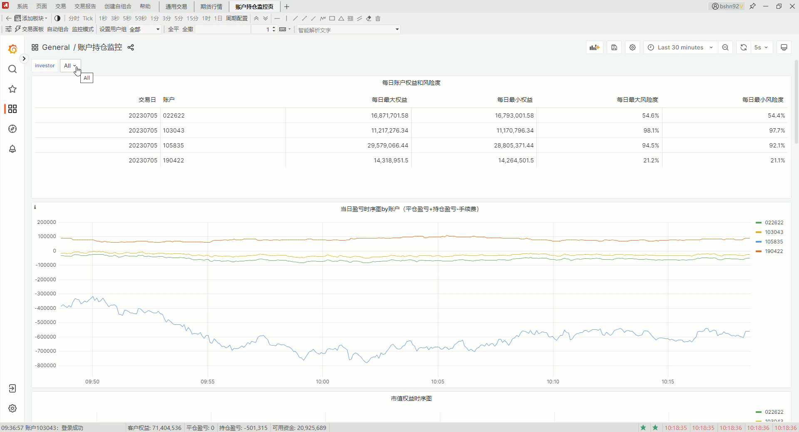

.. _profession:

TqSdk 专业版
=================================================
TqSdk 中大部分功能是供用户免费使用的, 同时我们也提供了专业版的增值功能供用户选择

如果想使用 TqSdk 专业版功能，可以登录 `个人中心 <https://account.shinnytech.com/>`_ 申请15天试用或正式购买

快期专业版产品使用权限
-------------------------------------------------
在当用户购买专业版的产品服务时，不仅仅是包含 TqSdk 专业版的功能，同时也包含一份对应时长的快期专业版使用权限

`快期专业版 <https://www.shinnytech.com/qpro/>`_ 是专门为专业用户开发的一套PC客户端，能支持用户多账户，多柜台(CTP,CTPMINI,易盛v10,v9,大连Xone,融航,杰宜斯)等柜台登录

此外还提供了丰富的交易手段与监控功能，帮助用户在程序化交易的同时能有一个PC端进行辅助监控与交易

其中的持仓账户监控功能，内置了一基于 grafana 实时的监控手段，每10s存储一次用户的账户和持仓数据在本地，供用户对这些数据进行可视化分析

例如回答用户今天的客户权益变动情况，和今天的最大权益和最小权益的发生时间等

 `快期专业版官网地址 <https://www.shinnytech.com/qpro>`_

 `快期专业版文档地址 <https://publish2.shinnytech.com/doc/qpro/latest/quickstart.html>`_

更稳定的行情服务器
-------------------------------------------------
在每次的行情服务器升级当中，我们会优先选择连接到免费版行情服务器中的百分之十左右的用户进行升级，然后在稳定后逐步扩大免费版的升级范围

专业版的行情服务器会在免费版全部升级成功且没有问题之后再进行升级，因此对于 TqSdk 的专业版用户来说，会有更稳定行情服务器连接

更多的期货公司支持
-------------------------------------------------
对于 TqSdk 免费版，用户只能选择指定的期货公司进行免费实盘交易，专业版支持用户选择其他的期货公司来进行交易

支持免费实盘交易的期货公司，和  `全部期货公司的名单列表 <https://www.shinnytech.com/blog/tq-support-broker//>`_

TqSdk 免费版和专业版均支持用户绑定3个账户，如需一个快期账户支持更多的实盘账户，请联系工作人员进行批量购买 QQ:532428198

如果需要注册快期账户或者修改您的快期账户绑定的实盘账户，请点击 `登录用户管理中心 <https://account.shinnytech.com/>`_

登录成功后显示如下，在下方红框处,用户可以自行解绑/绑定实盘账户，其中解绑操作每天限定一次

.. figure:: images/user_web_management.png

股票行情
-------------------------------------------------
TqSdk 免费版本提供全部的期货、商品/金融期权和上证50、沪深300和中证500的实时行情

购买或申请 TqSdk 专业版试用后可提供A股股票的实时和历史行情，TqSdk 中股票示例代码参考如下::

	SSE.600000 - 上交所浦发银行股票编码
	SZSE.000001 - 深交所平安银行股票编码
	SSE.000016 - 上证50指数
	SSE.000300 - 沪深300指数
	SSE.000905 - 中证500指数
	SSE.510050 - 上交所上证50etf
	SSE.510300 - 上交所沪深300etf
	SZSE.159919 - 深交所沪深300etf
	SSE.10002513 - 上交所上证50etf期权
	SSE.10002504 - 上交所沪深300etf期权
	SZSE.90000097 - 深交所沪深300etf期权

.. _profession_tqkqstock:

股票模拟交易
-------------------------------------------------
TqSdk 提供了 :py:class:`~tqsdk.TqKqStock` 方法供用户来进行股票的模拟交易

专业版用户可以长久的对同一账户进行模拟股票交易测试

需要注意股票模拟交易下，get_account，get_order，get_position 会返回对应股票交易模型下的 objs ，如 :py:class:`~tqsdk.objs.SecurityAccount`， :py:class:`~tqsdk.objs.SecurityOrder`，:py:class:`~tqsdk.objs.SecurityPosition`

参考代码如下::

    from tqsdk import TqApi, TqAuth, TqKqStock

    tq_kq_stock = TqKqStock()
    api = TqApi(account=tq_kq_stock, auth=TqAuth("快期账户", "账户密码"))
    quote = api.get_quote("SSE.688529")
    print(quote)
    # 下单限价单
    order = api.insert_order("SSE.688529", volume=200, direction="BUY", limit_price=quote.ask_price1)
    while order.status == 'ALIVE':
        api.wait_update()
        print(order)  # 打印委托单信息

    print(api.get_account())  # 打印快期股票模拟账户信息

    print(api.get_position("SSE.688529"))  # 打印持仓信息

    for trade in order.trade_records.values():
        print(trade)  # 打印委托单对应的成交信息
    api.close()

下载数据功能
-------------------------------------------------
数据下载工具 :py:class:`~tqsdk.tools.DataDownloader` 是 TqSdk 专业版中的功能

支持专业版用户下载目前 TqSdk 提供的全部期货、期权和股票类的历史数据，下载数据支持 tick 级别精度和任意 kline 周期

其他相关函数
-------------------------------------------------

 :py:meth:`~tqsdk.TqApi.get_kline_data_series` 以起始日期获取 Dataframe 格式的 kline 数据

工作时间内的天勤客服支持
-------------------------------------------------
如果您是 TqSdk 专业版的年费用户，那么我们将会单独为您建立一个讨论组，里面会有 TqSdk 的专门技术支持人员在工作时间内优先回答您的问题