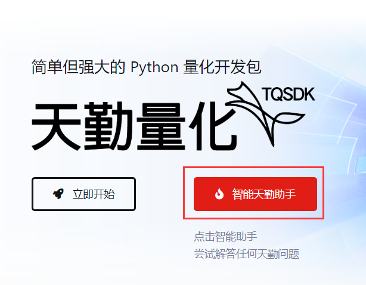
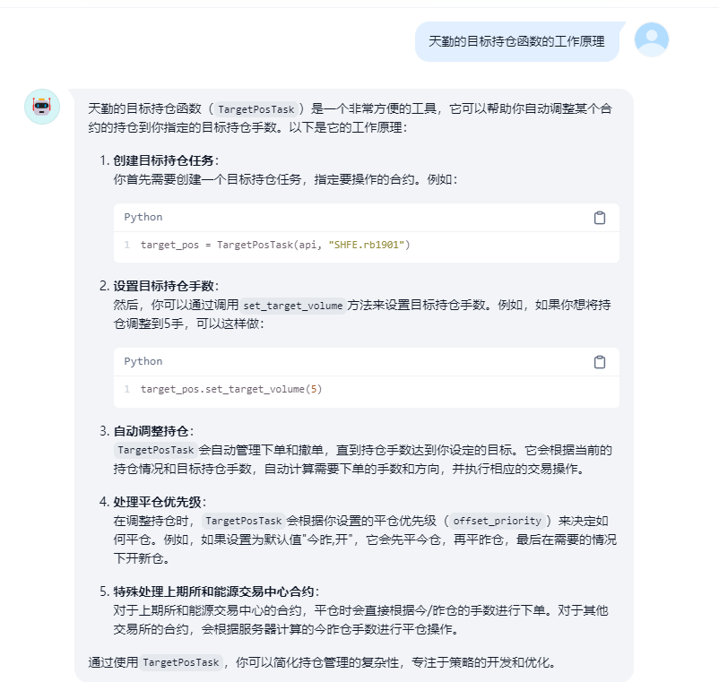
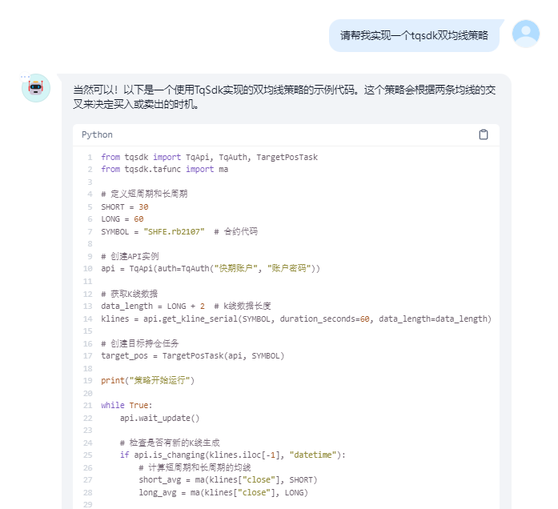
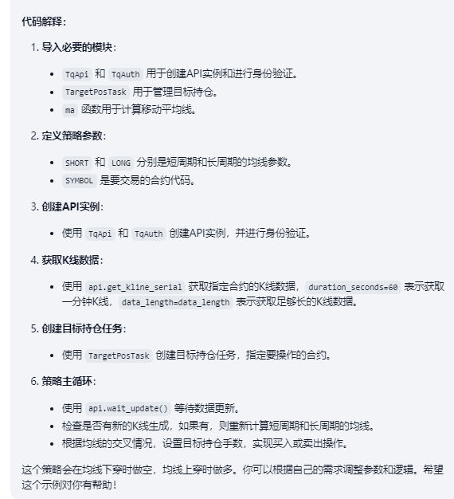

.. _quickstart:

十分钟快速入门
=================================================
希望快速开始使用天勤量化(TqSdk)？  本页面将介绍如何开始使用 TqSdk.

如果您以前曾经使用过其它框架编写过策略程序, 这些内容可以快速帮助您了解 TqSdk 与它们的区别:

* :ref:`intro`
* :ref:`for_ctp_user`
* :ref:`for_vnpy_user`

注意: TqSdk 使用了 python3 的原生协程和异步通讯库 asyncio，部分 Python IDE 不支持 asyncio，例如:

* spyder: 详见 https://github.com/spyder-ide/spyder/issues/7096
* jupyter: 详见 https://github.com/jupyter/notebook/issues/3397

可以直接运行示例代码，或使用支持 asyncio 的 IDE (例如: pycharm / vscode)

.. _tqsdk_install:

安装
-------------------------------------------------
天勤量化的核心是TqSdk开发包, 在安装天勤量化 (TqSdk) 前, 你需要先准备适当的环境和Python包管理工具, 包括:

* Python >=3.7,3.8,3.9,3.10,3.11,3.12 版本
* Windows 7 以上版本, Mac Os, 或 Linux

你可以选择使用 `pip` 命令安装 TqSdk, 或者下载源代码安装. 对于一般用户, 我们推荐采用 `pip` 命令安装/升级 TqSdk::

    pip install tqsdk -U

但是由于 `pip` 使用的是国外的服务器，普通用户往往下载速度过慢或不稳定，对于使用 `pip` 命令下载速度较慢的用户，我们推荐采用切换国内源的方式安装/升级 TqSdk::

    pip install tqsdk -U -i https://pypi.tuna.tsinghua.edu.cn/simple --trusted-host=pypi.tuna.tsinghua.edu.cn

.. _quickstart_0:

注册快期账户
-------------------------------------------------
在使用 TqSdk 之前，用户需要先注册自己的 **快期账户** ，传入快期账户是使用任何 TqSdk 程序的前提,点击  `注册快期账户 <https://account.shinnytech.com/>`_

快期账户可以使用注册时的手机号/用户名/邮箱号进行登录,详细介绍请点击 :ref:`shinny_account`

在注册完快期账户后，让我们从一个简单的例子开始

.. _quickstart_1:

获取实时行情数据
-------------------------------------------------
通过 TqSdk 获取实时行情数据是很容易的.

首先, 必须引入 tqsdk 模块::

    from tqsdk import TqApi, TqAuth

创建API实例，并填入自己的快期账户::

    api = TqApi(auth=TqAuth("快期账户", "账户密码"))

获得上期所 ni2206 合约的行情引用::

    quote = api.get_quote("SHFE.ni2206")

现在, 我们获得了一个对象 quote. 这个对象总是指向 SHFE.ni2206 合约的最新行情. 我们可以通过 quote 的各个字段访问行情数据::

    print (quote.last_price, quote.volume)

要等待行情数据更新, 我们还需要一些代码::

    while True:
        api.wait_update()
        print (quote.datetime, quote.last_price)

:py:meth:`~tqsdk.TqApi.wait_update` 是一个阻塞函数, 程序在这行上等待, 直到收到数据包才返回.

上面这个例子的完整程序请见 :ref:`tutorial-t10` . 你也可以在自己电脑python安装目录的 site_packages/tqsdk/demo 下找到它

很简单, 对吗? 到这里, 你已经了解用 TqSdk 开发程序的几个关键点:

* 创建 TqApi 实例
* 用 api.get_quote() 或 其它函数获取数据引用对象
* 在循环中用 api.wait_update() 等待数据包.
* 收到数据包以后通过引用对象获得所需数据

下面我们将继续介绍 TqSdk 更多的功能. 无论使用哪个功能函数, 都遵循上面的结构.

.. _quickstart_2:

使用K线数据
-------------------------------------------------
你很可能会需要合约的K线数据. 在TqSdk中, 你可以很方便的获得K线数据. 我们来请求 ni2206 合约的10秒线::

    klines = api.get_kline_serial("SHFE.ni2206", 10)

klines是一个pandas.DataFrame对象. 跟 api.get_quote() 一样, api.get_kline_serial() 也是返回K线序列的引用对象. K线序列数据也会跟实时行情一起同步自动更新. 你也同样需要用 api.wait_update() 等待数据刷新.

一旦k线数据收到, 你可以通过 klines 访问 k线数据::

    while True:
        api.wait_update()
        print("最后一根K线收盘价", klines.close.iloc[-1])

这部分的完整示例程序请见 :ref:`tutorial-t30` .

我们也可以通过传入一个合约列表作为参数，来获取包含多个合约数据的K线::

    klines = api.get_kline_serial(["SHFE.au1912", "SHFE.au2006"], 5)  # 获取SHFE.au2006向SHFE.au1912对齐的K线

详细使用方法及说明请见 :py:meth:`~tqsdk.TqApi.get_kline_serial` 函数说明。

到这里为止, 你已经知道了如何获取实时行情和K线数据, 下面一段将介绍如何访问你的交易账户并发送交易指令

.. _quickstart_2_web_gui:

生成图形化界面
-------------------------------------------------
如果想要将你订阅的K线或策略图形化显示, 只需在 :py:meth:`~tqsdk.TqApi` 中传入参数 web_gui = True即可::

        # 引入TqSdk模块
        from tqsdk import TqApi, TqAuth
        # 创建api实例，设置web_gui=True生成图形化界面
        api = TqApi(web_gui=True, auth=TqAuth("快期账户", "账户密码"))
        # 订阅 ni2010 合约的10秒线
        klines = api.get_kline_serial("SHFE.ni2010", 10)
        while True:
            # 通过wait_update刷新数据
            api.wait_update()

当你运行该程序后，预期会显示如下两条信息::

        2019-12-13 10:45:26,468 - INFO - 您可以访问 http://127.0.0.1:62964 查看策略绘制出的 K 线图形。
        2019-12-13 10:45:27,422 - INFO - 通知: 与 wss://openmd.shinnytech.com/t/md/front/mobile 的网络连接已建立

点击生成的地址，即可访问订阅的K线图形

.. figure:: images/web_gui_demo.png

具体请见 :ref:`web_gui`

.. _quickstart_3:

交易账户, 下单/撤单
-------------------------------------------------
要获得你的账户资金情况, 可以请求一个资金账户引用对象::

    account = api.get_account()

要获得你交易账户中某个合约的持仓情况, 可以请求一个持仓引用对象::

    position = api.get_position("DCE.m1901")

与行情数据一样, 它们也通过 api.wait_update() 获得更新, 你也同样可以访问它们的成员变量::

    print("可用资金: %.2f" % (account.available))
    print("今多头: %d 手" % (position.volume_long_today))

要在交易账户中发出一个委托单, 使用 api.insert_order() 函数::

    order = api.insert_order(symbol="DCE.m2105", direction="BUY", offset="OPEN", volume=5, limit_price=3000)

这个函数调用后会立即返回, order 是一个指向此委托单的引用对象, 你总是可以通过它的成员变量来了解委托单的最新状态::

    print("委托单状态: %s, 已成交: %d 手" % (order.status, order.volume_orign - order.volume_left))

要撤销一个委托单, 使用 api.cancel_order() 函数::

    api.cancel_order(order)

这部分的完整示例程序请见 :ref:`tutorial-t40` .

到这里为止, 我们已经掌握了 TqSdk 中行情和交易相关功能的基本使用. 我们将在下一节中, 组合使用它们, 创建一个自动交易程序

.. _quickstart_4:

构建一个自动交易程序
-------------------------------------------------
在这一节中, 我们将创建一个简单的自动交易程序: 每当行情最新价高于最近15分钟均价时, 开仓买进. 这个程序是这样的::

    klines = api.get_kline_serial("DCE.m2105", 60)
    while True:
        api.wait_update()
        if api.is_changing(klines):
            ma = sum(klines.close.iloc[-15:])/15
            print("最新价", klines.close.iloc[-1], "MA", ma)
            if klines.close.iloc[-1] > ma:
                print("最新价大于MA: 市价开仓")
                api.insert_order(symbol="DCE.m2105", direction="BUY", offset="OPEN", volume=5)

上面的代码中出现了一个新函数 api.is_changing(). 这个函数用于判定指定对象是否在最近一次 wait_update 中被更新.

这部分的完整示例程序请见 :ref:`tutorial-t60` .

.. _quickstart_5:

按照目标持仓自动交易
-------------------------------------------------
在某些场景中, 我们可能会发现, 自己写代码管理下单撤单是一件很麻烦的事情. 在这种情况下, 你可以使用 :py:class:`tqsdk.TargetPosTask`. 你只需要指定账户中预期应有的持仓手数, TqSdk 会自动通过一系列指令调整仓位直到达成目标. 请看例子::

    # 创建 ni2010 的目标持仓 task，该 task 负责调整 ni2010 的仓位到指定的目标仓位
    target_pos_near = TargetPosTask(api, "SHFE.ni2010")
    # 创建 ni2011 的目标持仓 task，该 task 负责调整 ni2011 的仓位到指定的目标仓位
    target_pos_deferred = TargetPosTask(api, "SHFE.ni2011")

    while True:
        api.wait_update()
        if api.is_changing(quote_near) or api.is_changing(quote_deferred):
            spread = quote_near.last_price - quote_deferred.last_price
            print("当前价差:", spread)
            if spread > 200:
                print("目标持仓: 空近月，多远月")
                # 设置目标持仓为正数表示多头，负数表示空头，0表示空仓
                target_pos_near.set_target_volume(-1)
                target_pos_deferred.set_target_volume(1)
            elif spread < 150:
                print("目标持仓: 空仓")
                target_pos_near.set_target_volume(0)
                target_pos_deferred.set_target_volume(0)

这部分的完整示例程序请见 :ref:`tutorial-t80` .

.. _quickstart_backtest:

策略回测
-------------------------------------------------
自己的交易程序写好以后, 我们总是希望在实盘运行前, 能先进行一下模拟测试. 要进行模拟测试, 只需要在创建TqApi实例时, 传入一个backtest参数::

    api = TqApi(backtest=TqBacktest(start_dt=date(2018, 5, 1), end_dt=date(2018, 10, 1)), auth=TqAuth("快期账户", "账户密码"))

这样, 程序运行时就会按照 TqBacktest 指定的时间范围进行模拟交易测试, 并输出测试结果.

此外 TqSdk 同时还支持股票的回测交易，请见 :ref:`security_backtest`

更多关于策略程序回测的详细信息, 请见 :ref:`backtest`

.. _real_trading:

实盘交易
-------------------------------------------------
要让策略程序在实盘账号运行, 请在创建TqApi时传入一个 :py:class:`~tqsdk.TqAccount` , 填入 期货公司, 账号, 密码 和快期账户信息(使用前请先 import TqAccount)::

  from tqsdk import TqApi, TqAuth, TqAccount

# 如果要更换为徽商期货，只需要改为 H徽商期货
  api = TqApi(TqAccount("H宏源期货", "412432343", "123456"), auth=TqAuth("快期账户", "账户密码"))

更多关于实盘交易细节，请点击 :ref:`trade`

其中实盘交易是属于 TqSdk 的专业版功能，用户需要购买 TqSdk 专业版才可以进行实盘交易， `点击申请试用或者购买 <https://account.shinnytech.com/>`_

于此同时，TqSdk 支持在部分的期货公司开户来进行免费的实盘交易，详细期货公司介绍请点击查看 `TqSdk支持的期货公司列表 <https://www.shinnytech.com/blog/tq-support-broker/>`_

.. _sim_trading:

模拟交易和论坛
-------------------------------------------------
如果您需要使用能保存账户资金及持仓信息的模拟交易功能,通过 :py:class:`~tqsdk.TqKq` 对 auth 传入参数进行登录，可以得到一个长期有效的快期模拟账户，快期模拟账户在快期APP、快期专业版、快期v2、快期v3 和天勤量化上是互通的

快期模拟的资金可以通过快期APP、快期专业版的模拟银行进行出入金，也可以通过快期专业版对该账户进行重置::

  from tqsdk import TqApi, TqAuth, TqKq

  api = TqApi(TqKq(), auth=TqAuth("快期账户", "账户密码"))

特别的，如果创建TqApi实例时没有提供任何 TqAcccount 账户或 TqKq 模块，则每次会自动创建一个临时模拟账号，当程序运行结束时，临时账号内的记录将全部丢失::

  api = TqApi(auth=TqAuth("快期账户", "账户密码"))

TqSdk AI 助手
-------------------------------------------------
TqSdk 基于先进的大语言模型和常见天勤问题资料库，提供了新一代的 AI 助手

解释函数，编写demo策略，分析代码报错原因，它都有不错的表现 `点击使用 <https://udify.app/chat/im02prcHNEOVbPAx/>`_

.. figure:: images/llm_pic3.png
.. figure:: images/llm_pic4.png

.. figure:: images/llm_pic7.png

TqSdk 学习视频
-------------------------------------------------
TqSdk 提供简单易懂的十分钟上手视频 `供用户学习 <https://www.shinnytech.com/tqsdkquickstart/>`_

更多内容
-------------------------------------------------
* 要完整了解TqSdk的使用, 请阅读 :ref:`usage`
* 更多TqSdk的示例, 请见 :ref:`demo_strategy`

