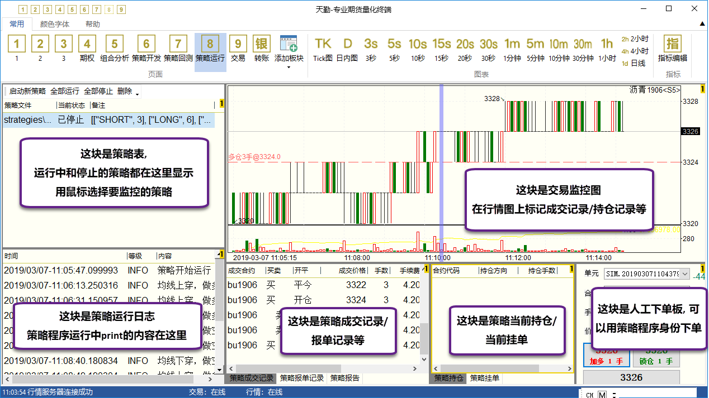
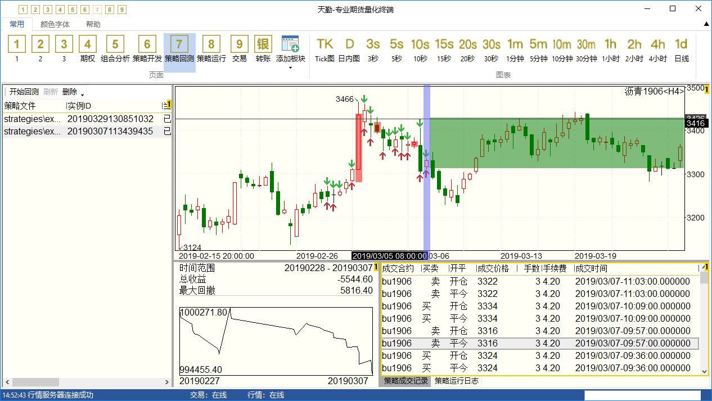
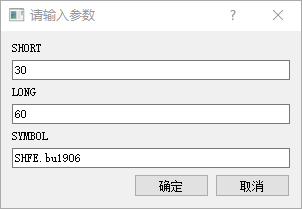
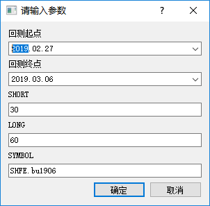

.. _tq:

在天勤程序化交易软件中运行Python策略程序
=========================================================================

`天勤程序化交易软件 <https://www.shinnytech.com/tianqin>`_ 是一款基于TqSdk开发的程序化交易软件.

天勤软件中内置了完整的Python环境和TqSdk包。使用TqSdk开发的python程序，可以不加任何修改，放入天勤软件中运行或回测. 天勤将为策略程序运行提供一系列支持.

要了解天勤软件的使用，请参阅 `天勤使用说明书 <https://doc.shinnytech.com/tq/latest>`_ .

要下载安装天勤软件，请到 `官网 <https://www.shinnytech.com/tianqin>`_

交易单元隔离
--------------------------------------------------------------------------
在天勤中运行多个策略时，天勤对每个策略实例的持仓、报单和交易记录分别管理，体现在：

* 每个策略程序开始运行时, 持仓手数均视为0.
* 策略程序中的 get_position, get_order 等函数，获得的是本策略的持仓和委托单信息
* 策略程序中使用 TargetPosition 设置目标持仓, 不影响其它策略程序

策略运行监控
--------------------------------------------------------------------------
天勤对每个策略实例分别提供运行监控，包括：

* 在天勤的【策略运行】页面上，任意选中一个策略，都会立即显示出这个策略的报单、成交记录。
* 和策略回测一样，天勤也为策略运行的交易和持仓记录提供图表标记。
* 每个策略都可以随时停止或重新开始运行。策略多次运行的交易记录和日志，会合并到同一个文件。

【策略运行】页面上放置的下单板，允许用户以任意策略的身份手工下单。这些报单和对应的持仓变化会被计入相应策略中.

天勤会自动保存用户策略的全部报单和print输出信息到硬盘文件，并可在天勤中随时查看

策略回测支持
--------------------------------------------------------------------------
在天勤中对策略执行回测，会在行情图表上展示完整的交易情况，包括:

* 在行情图上标出持仓时段和持仓盈亏
* 在行情图上标出所有成交点
* 点击成交记录，K线图直接定位到对应时间
* 行情图可以任意切换周期
* 支持涉及多个合约的交易策略

在天勤中对策略程序回测时，回测结果将在回测过程中不断动态更新，您无需等到回测结束即可看到部分回测结果，并可随时停止

天勤中可以同时对任意多个策略执行回测，并自动永久保存回测结果，可在天勤中随时查看

.. _mdreplay:

历史复盘
--------------------------------------------------------------------------
策略回测解决的是用来评价一个策略整体是否有效，但在回测过程中可能还会遇到交易时点和预期的不符，或者极端行情下策略表现异常等问题。
这个时候可能需要看看当时的行情具体是怎么走的，策略具体是怎么执行的，或者在策略实现阶段需要在非交易时间调试，这时就可以使用由天勤终端提供的历史复盘功能。

只需指定任一交易日，天勤终端将回到那一天，并完整重演全天的行情变化。在此过程中，使用 TqSdk 对接到天勤终端之后获取的数据都是所指定日期的数据，
一切都有如真正回到那天一样。并可在回放过程中可以任意暂停或加减速。

首先 `打开天勤终端并进入复盘模式 <https://doc.shinnytech.com/tq/latest/usage/mdreplay.html>`_ ，然后在创建 TqApi 实例时帐号填写为 "SIM" 策略就会进入历史复盘模式::

    api = TqApi("SIM")

之后策略的所有交易操作都可以在天勤终端中看到，并会标注到行情图上。同时也可以加减速或暂停行情回放，仔细分析策略执行情况。

在天勤中的行情图上绘制任意指标或者其它图形
--------------------------------------------------------------------------
策略程序在天勤中运行时，天勤将自动为每个运行中的策略提供一个专用行情图窗口。
这个行情图窗口除显示K线外，策略程序还可以用程序指令在这个行情图上绘制指标或者其它图形，像这样:

@todo: 补图, 补天勤文档链接

关于策略程序中绘图的详细说明，请见 `这里 <https://doc.shinnytech.com/tq/latest/coding.html>`_ .

注意事项
--------------------------------------------------------------------------

策略程序的交易账户将是天勤软件的当前登录账户
~~~~~~~~~~~~~~~~~~~~~~~~~~~~~~~~~~~~~~~~~~~~~~~~~~~~~~~~~~~~~~~~~~~~~~~~~~
按照TqSdk文档，我们总是在创建TqApi时指定交易账户，类似这样::

    api = TqApi(TqSim())  # 使用模拟交易
    api = TqApi(TqAccount("xx期货", "475892", "123838"))  # 使用实盘交易账户

当这个策略被放入天勤中运行时，**指定交易账户的代码将【无效】，策略的所有交易行为，将指向当前天勤软件登录的交易账号** （实盘或模拟）

类似的，这个程序在天勤中也可以直接进行回测，而不需要在TqApi创建时加入backtest参数

天勤中启动运行的策略实例与当前登录账号绑定
~~~~~~~~~~~~~~~~~~~~~~~~~~~~~~~~~~~~~~~~~~~~~~~~~~~~~~~~~~~~~~~~~~~~~~~~~~
天勤中启动运行的策略实例与当前登录账号绑定，当天勤以其它账号登录时，不会显示非此账号创建的策略实例。

天勤将为策略程序中的参数变量自动提供输入面板
~~~~~~~~~~~~~~~~~~~~~~~~~~~~~~~~~~~~~~~~~~~~~~~~~~~~~~~~~~~~~~~~~~~~~~~~~~
如果您希望在策略中设置一些参数，在策略每次运行时输入，您只需要:

* 用全大写字符作为参数变量名
* 确保这些参数在TqApi创建前出现
* 参数是整数、浮点数或字符串类型

以 doublema.py 为例::

    from tqsdk import TqApi, TqSim, TargetPosTask

    SHORT = 30  # 短周期
    LONG = 60  # 长周期
    SYMBOL = "SHFE.bu1906"  # 合约代码

    api = TqApi(TqSim())
    ...

这个策略在天勤中运行时，会自动出现这样的参数输入面板:

回测时则会出现这样的参数输入面板:

其它注意事项
~~~~~~~~~~~~~~~~~~~~~~~~~~~~~~~~~~~~~~~~~~~~~~~~~~~~~~~~~~~~~~~~~~~~~~~~~~
* 天勤默认的策略代码位置在天勤的 strategies 目录，其中 user 目录用来保存用户在天勤中创建的策略
* 天勤中内置的Python版本为 3.6.7 64位版，并预装了 tqsdk, numpy, pandas 等库。如果您的策略使用了某些天勤没有预装的库，您可以自行将相应的库文件放置到天勤安装目录的python目录下
* 天勤中每启动一个策略，都会在天勤的instances目录下创建两个文件，其中 xxxxx.desc 含有策略程序名和策略参数表，xxxxx.report 记录了策略的报单、成交及日志。
* 天勤中执行的策略回测，也会在天勤的backtests目录下创建两个文件，格式同上

