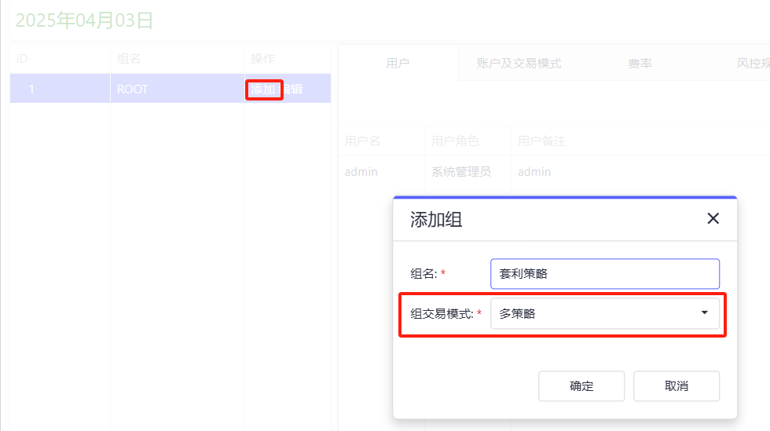
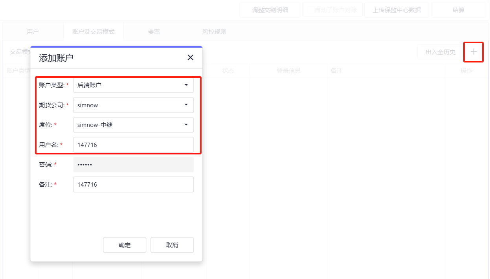
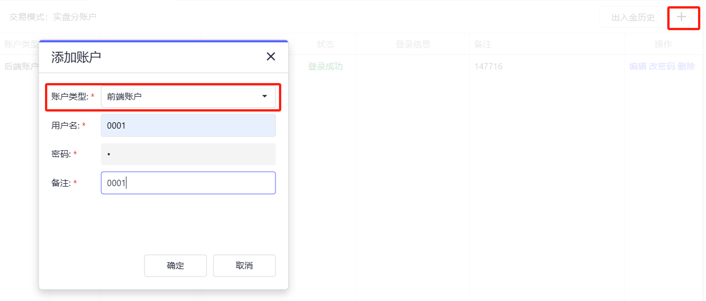
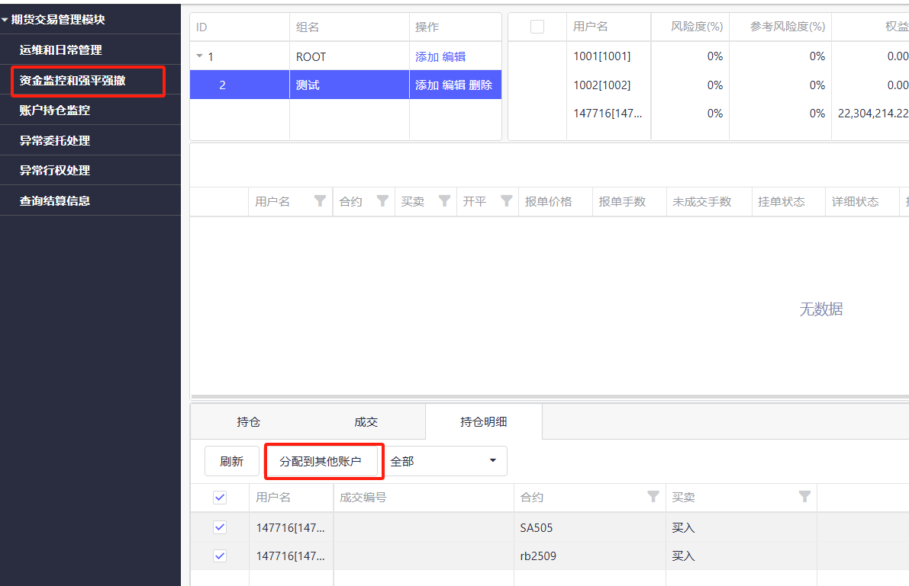
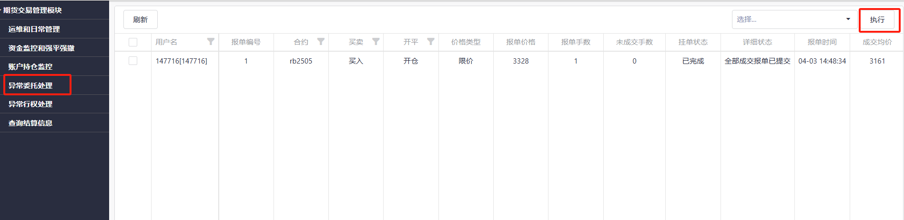
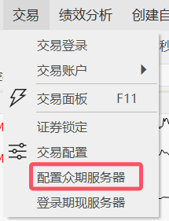
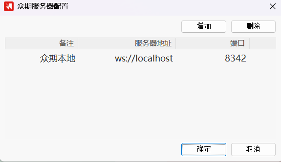
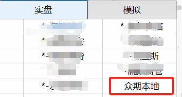

.. _tq_trading_unit:

============================
TqSdk 多策略使用手册
============================

概述
=====
随着对收益曲线稳定的追求，较多用户需要在一个账户下去运行多个策略，当多个策略交易同一标的时，则面临着不同策略的持仓管理，绩效归因等问题

为了解决该问题, :ref:`enterprise` 中提供了本地众期多策略系统，支持用户在本地将一个实盘账户拆分为多个策略（多个前端账户），每个策略交易数据相互隔离，且跨日有效

同时该方案会提供多策略的管理界面，支持可视化观察各个多策略的持仓，委托，资金和盈亏情况，也支持以策略维度（前端账户）登录 `快期专业版 <https://www.shinnytech.com/qpro>`_ 进行管理与交易

系统配置要求
============
- **Windows**: >= Windows 10
- **Linux**: >= Ubuntu 22.04
- **tqsdk**: >= 3.8.0
- **快期专业版**: >= 2504.659

安装
====
使用本地众期多策略系统需要安装 `tqsdk-zq` 包，用来初始化本地环境::

    pip install tqsdk-zq

对于 Windows 用户，还需要安装 Microsoft Visual C++ Redistributable，下载地址：
`Microsoft Redistributable <https://aka.ms/vs/17/release/vc_redist.x64.exe>`_

使用流程
========

1. **初始化本地环境**::

    tqsdk-zq init --kq-name=xx --kq-password=xx --web-port=xx

- kq-name 是快期账户，kq-password 是快期密码，web-port 是可选项，不用指定
- 初始化完成后，控制台会输出多策略管理页的账户、密码以及网址，默认账户密码均为 admin,
- 后续跨交易日，重启电脑，不用再执行初始化步骤，直接运行 python 代码即可
- 打开浏览器，访问控制台输出的网址

2. **打印多策略控制台地址**::

    tqsdk-zq web

- 如果机器重启或者网页打不开了，请执行以上命令
- 进程重新拉起后，控制台会输出管理页网址
- web 管理端在跨交易日后，需要输入 tqsdk-zq web 拉起

3. **访问众期管理页**:

- 在运维和日常管理页添加组
- 在组中选择模式为多策略
- 在策略组中，选择账户及交易模式，然后点击右侧的+号，添加后端账号（实盘账户或simnow账户）
- 继续点击+号添加前端账户（多策略）并设置入金金额
- 如果后端账户有持仓，则需要在资金监控和强平强撤页的持仓明细来分配各个前端账户的持仓

4. **使用 TqTradingUnit 登录前端账户**::

    from tqsdk import TqApi, TqTradingUnit, TqAuth

    # 在天勤中登录前端账户时，只用输入账户名即可，不用输入前端账户密码
    account = TqTradingUnit(account_id="前端账户号")
    api = TqApi(account, auth=TqAuth("快期账户", "账户密码"))

异常委托分配
=============

当使用众期多策略进行交易后，系统默认该后端账户下的所有交易指令，均由前端账户发出，当后端账户发出了某笔委托而未指定前端账户时，则会被归类为异常委托范围

当系统存在异常委托时，会每隔固定时间，向前端账户推送通知，提醒用户将异常委托进行分配到具体前端账户，如果本交易日未进行分配，会导致下一个交易日众期系统初始化失败

在下一个交易日如果由于该原因初始化失败后，前端账户的持仓将都会清空，用户需要重新从后端账户往前端账户分配持仓

快期专业版里面登录多策略（前端账户）
==============================================
- 点击左上角交易按钮里面的配置众期服务器
- 在备注项设置站点名称，服务器地址项设置本地交易地址，本地交易地址为 ws://localhost ，端口号在用户不设置的情况下默认为 8342
- 在登录的站点里面选择刚刚添加的站点登录

其他事项
=========
- 当用户在众期多策略系统中添加实盘账户时，仍然占用企业版3个实盘账户的名额，如果需要额外购买实盘账户名额请联系我们的商务同事 QQ:1539404802
- 多策略的拆分和运行均在本地，不支持跨电脑使用多策略功能
- 如果需要删除前端账户，需要先清除持仓（平仓，或者通过持仓划转），然后将出入金转出，才可以删除

版本变更
=========
使用 `pip install -U --upgrade-strategy eager tqsdk-zq` 更新多策略功能所有依赖包

.. line-block::
    **2025/06/16**
    tqsdk-zq: 1.0.3
    tqsdk-zq-server: 1.0.5
    tqsdk-zq-history: 1.0.0
    tqsdk-zq-pgserver: 1.0.0
    tqsdk-zq-proxy: 1.0.0

* 新增: 添加历史结算信息查询功能

.. line-block::
    **2025/06/03**
    tqsdk-zq: 1.0.2
    tqsdk-zq-server: 1.0.4
    tqsdk-zq-pgserver: 1.0.0
    tqsdk-zq-proxy: 1.0.0

* 修复: 快期模拟添加进用户实盘账户列表

.. line-block::
    **2025/04/29**
    tqsdk-zq: 1.0.2
    tqsdk-zq-server: 1.0.3
    tqsdk-zq-pgserver: 1.0.0
    tqsdk-zq-proxy: 1.0.0

* 修复: 和本地其他 postgres 进程端口冲突的问题
* 修复: 持仓划转失败的问题
* 修复: 风控规则高级模式没有正确传递 enable 参数的问题