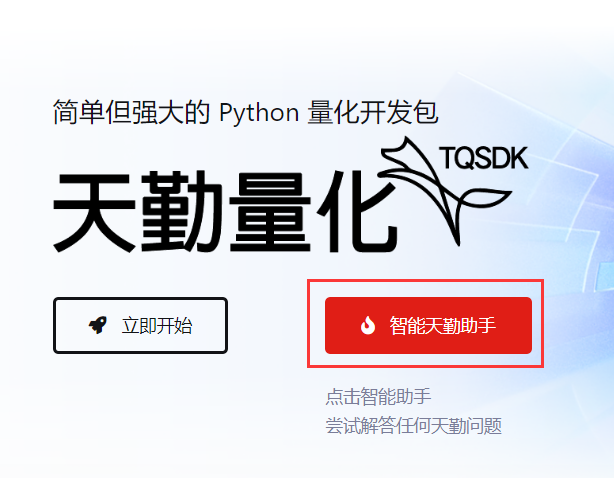
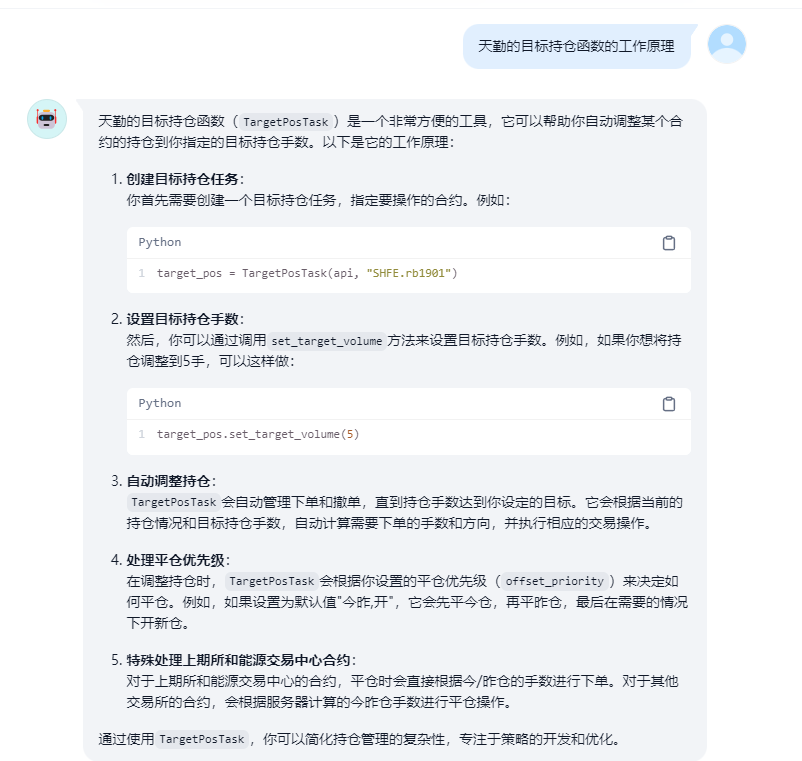
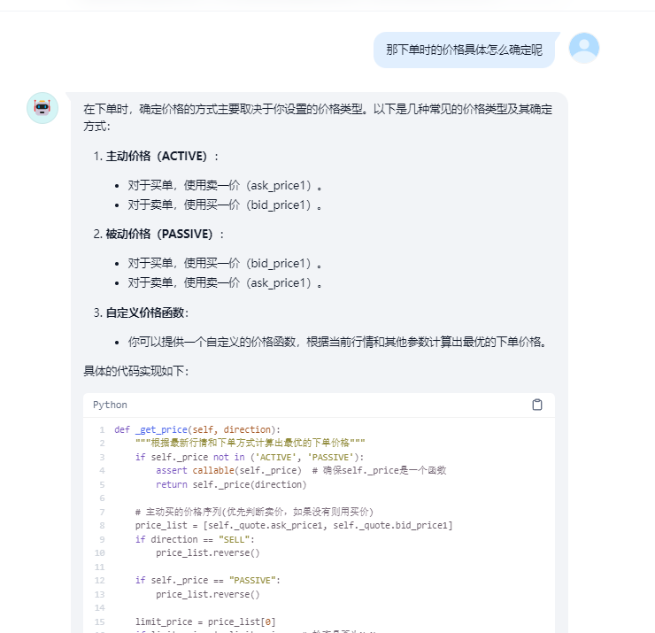
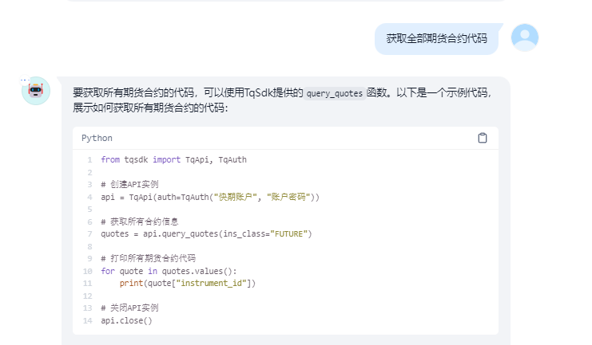
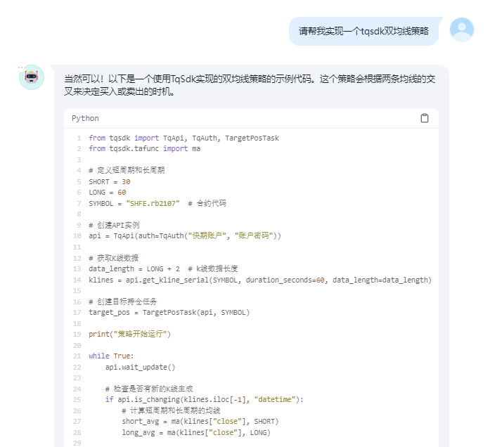
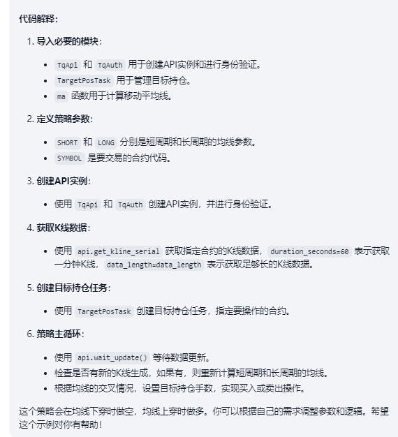
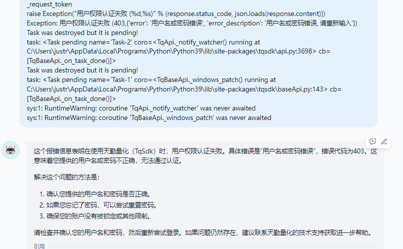

.. _tqsdk_llm:

天勤量化 AI 助手
-----------------------------------------------
在使用天勤的过程中，用户往往会遇到各种问题，尤其是初学者，他们可能会关心以下几点：

* 天勤量化可以实现哪些功能？
* 如何编写实现这些功能的大致代码？
* 文档中某些函数的具体参数是什么意思？

当度过初学者的阶段后，用户可能会遇到以下情况：

* 如何解决天勤或 Python 报错？
* 如何优化策略代码逻辑？
* 某个特定功能在天勤中如何实现？

这些问题都会成为用户使用天勤量化时的障碍。

为了帮助用户解决这些问题，我们结合了国内先进的大语言模型，推出了专门的智能机器人助手，旨在解答以下问题：

* 具体函数的详细介绍
* 根据具体需求或策略提供天勤实现的示例
* 天勤或 Python 报错的可能解决方案

点击即刻尝试  `使用天勤 AI 助手！ <https://udify.app/chat/im02prcHNEOVbPAx/>`_

下图是具体的使用示例 demo

