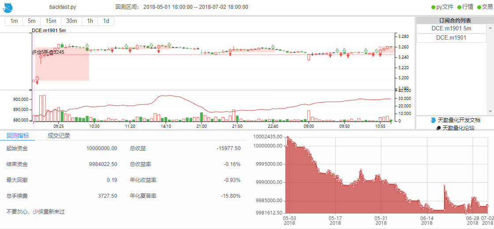

.. _backtest:

策略程序回测
=================================================
策略程序回测是 TqSdk 专业版中的功能，能让用户在不改变代码的情况下去回测自己的策略在历史行情的表现

如果想使用策略回测该功能，可以点击 `天勤量化专业版 <https://www.shinnytech.com/tqsdk-buy/>`_ 申请使用或购买

用户也可以申请模拟账户后模拟运行来检验策略 :ref:`sim_trading`

执行策略回测
-------------------------------------------------
使用 TqSdk 编写的策略程序，不需要修改策略代码，只需要在创建 api 实例时给backtest参数传入 :py:class:`~tqsdk.TqBacktest` , 策略就会进入历史回测模式::

  from datetime import date
  from tqsdk import TqApi, TqAuth, TqSim, TqBacktest

  api = TqApi(TqSim(), backtest=TqBacktest(start_dt=date(2018, 5, 1), end_dt=date(2018, 10, 1)), auth=TqAuth("快期账户", "账户密码"))

使用tqsdk在回测结束后会输出交易记录和每日收盘时的账户资金情况，以及最大回撤、夏普比率等指标，这些数据可以导入到 excel 中或使用其他分析工具进一步处理。

回测示例程序：:ref:`tutorial-backtest`

在回测结束时获取回测详细信息
-------------------------------------------------
要在回测结束时调用您自己写的代码, 可以使用 try/except 机制捕获回测结束信号 BacktestFinished, 像这样::

  from tqsdk import BacktestFinished

  acc = TqSim()

  try:
    api = TqApi(acc, backtest=TqBacktest(start_dt=date(2018, 5, 1), end_dt=date(2018, 10, 1)), auth=TqAuth("快期账户", "账户密码"))
    #策略代码在这里
    #...

  except BacktestFinished as e:
    # 回测结束时会执行这里的代码
    api.close()
    print(acc.trade_log)  # 回测的详细信息

    print(acc.tqsdk_stat)  # 回测时间内账户交易信息统计结果，其中包含以下字段
    # init_balance 起始资金
    # balance 结束资金
    # max_drawdown 最大回撤
    # profit_loss_ratio 盈亏额比例
    # winning_rate 胜率
    # ror 收益率
    # annual_yield 年化收益率
    # sharpe_ratio 年化夏普率
    # tqsdk_punchline 天勤点评

回测的详细信息保存在回测所用的模拟账户 TqSim 中, 可以直接访问它的成员变量 trade_log(格式为 日期->交易记录及收盘时的权益及持仓).

同时我们也提供简单的图形化的回测报告功能供大家使用 :ref:`web_gui` ，使用效果参考下图

.. _backtest_with_web_gui:

回测结束在浏览器中查看绘图结果
-------------------------------------------------

要在回测结束时，如果依然需要在浏览器中查看绘图结果，同时又需要打印回测信息，您应该这样做::

  from tqsdk import BacktestFinished

  acc = TqSim()

  try:
    api = TqApi(acc, backtest=TqBacktest(start_dt=date(2018, 5, 1), end_dt=date(2018, 10, 1)), auth=TqAuth("快期账户", "账户密码"))
    #策略代码在这里
    #...
  except BacktestFinished as e:
    print(acc.tqsdk_stat)  # 回测时间内账户交易信息统计结果，其中包含以下字段
    # 由于需要在浏览器中查看绘图结果，因此程序不能退出
    while True:
        api.wait_update()

.. _backtest_underlying_symbol:

回测时获取主连合约标的
-------------------------------------------------
在天勤中回测时，对于主连合约，我们支持用户使用 **quote.underlying_symbol** 获取回测当时的标的合约。

示例::

    from datetime import date
    from tqsdk import TqApi, TqAuth, TqBacktest, BacktestFinished

    api = TqApi(backtest=TqBacktest(start_dt=date(2020, 1, 1), end_dt=date(2020, 10, 1)), auth=TqAuth("快期账户", "账户密码"))

    quote = api.get_quote("KQ.m@CFFEX.T")
    print(quote.datetime, quote.underlying_symbol)
    try:
        while True:
            api.wait_update()
            if api.is_changing(quote, "underlying_symbol"):
                print(quote.datetime, quote.underlying_symbol)
    except BacktestFinished:
        api.close()

    # 预期输出：
    # 2019-12-31 15:14:59.999999 CFFEX.T2003
    # 2020-02-19 09:15:00.000000 CFFEX.T2006
    # 2020-05-14 09:15:00.000000 CFFEX.T2009
    # 2020-08-19 09:30:00.000000 CFFEX.T2012

.. _backtest_rule:

回测时的成交规则和推进
-------------------------------------------------
在天勤中回测时，除了期货、期权合约以外，我们还支持使用 **指数** 进行回测和在回测中交易，指数合约代码格式参见 :ref:`mddatas`

策略回测时使用内置模拟账户 :py:class:`~tqsdk.TqSim` , 默认回测资金为1000w , 如果需要修改初始回测资金，只需给 TqSim 传入需要设定的金额即可::

  from datetime import date
  from tqsdk import TqApi, TqAuth, TqSim, TqBacktest

  api = TqApi(TqSim(10000), backtest=TqBacktest(start_dt=date(2018, 5, 1), end_dt=date(2018, 10, 1)), auth=TqAuth("快期账户", "账户密码"))

撮合成交规则为对价成交. 即限价单的价格达到对手盘价格时判定为成交. 不会出现委托单部分成交的情况.

回测时策略程序报单, 会立即做一次成交判定.

回测框架的规则是当没有新的事件需要用户处理时才推进到下一个行情, 也就是这样::

  q = api.get_quote("SHFE.cu1901")
  api.wait_update()                     # 这个 wait_update 更新了行情
  api.insert_order("SHFE.cu1901", ...)  # 程序下单
  api.wait_update()                     # 这个 wait_update 只会更新委托单状态, 行情还是停在原处
  api.insert_order("SHFE.cu1901", ...)  # 如果又下了一个单
  api.wait_update()                     # 这个 wait_update 还是只会更新委托单状态, 行情还是停在原处
  api.wait_update()                     # 这个 wait_update 更新了行情

  

.. _security_backtest:

对股票合约进行回测
-------------------------------------------------
TqSdk 在 3.2.0 版本后支持了对股票合约进行回测功能，在回测过程中用户需要初始化 :py:class:`~tqsdk.TqSimStock` 类，且该类只能支持股票模拟交易

由于股票市场 T+1 的规则, :py:class:`~tqsdk.lib.TargetPosTask`  函数目前还不支持在股票交易中使用，股票合约交易时只支持使用 :py:class:`~tqsdk.TqApi.insert_order`

如果您想要在回测中同时交易期货和股票合约，则可以使用 :py:class:`~tqsdk.TqMultiAccount` 来实现该需求::

    # 同时使用 TqSim 交易期货，TqSimStock 交易股票
    from tqsdk import TqApi, TqAuth, TqMultiAccount, TqSim, TqSimStock

    tqsim_future = TqSim()
    tqsim_stock = TqSimStock()

    api = TqApi(account=TqMultiAccount([tqsim_future, tqsim_stock]), auth=TqAuth("快期账户", "账户密码"))

    # 多账户下单，需要指定下单账户
    order1 = api.insert_order(symbol="SHFE.cu2112", direction="BUY", offset="OPEN", volume=10, limit_price=72250.0, account=tqsim_future)
    order2 = api.insert_order(symbol="SSE.603666", direction="BUY", volume=300, account=tqsim_stock)
    while order1.status != 'FINISHED' or order2.status != 'FINISHED':
        api.wait_update()

    # 打印账户可用资金
    future_account = tqsim_future.get_account()
    stock_account = tqsim_stock.get_account()
    print(future_account.available, stock_account.available)
    api.close()

回测使用多行情序列的策略程序
-------------------------------------------------
TqSdk 允许一个策略程序中使用多个行情序列, 比如这样::

  #... 策略程序代码
  ka1 = api.get_kline_serial("SHFE.cu1901", 60)
  ka2 = api.get_kline_serial("SHFE.cu1901", 3600)
  kb  = api.get_kline_serial("CFFEX.IF1901", 3600)
  tsa  = api.get_tick_serial("CFFEX.IF1901")
  qa = api.get_quote("DCE.a1901")
  #... 策略程序代码

TqSdk回测框架使用一套复杂的规则来推进行情：

规则1: tick 序列(例如上面例子中的tsa) 总是按逐 tick 推进::

  tsa  = api.get_tick_serial("CFFEX.IF1901")
  print(tsa.datetime.iloc[-1])             # 2018/01/01 09:30:00.000
  api.wait_update()                           # 推进一个tick
  print(tsa.datetime.iloc[-1])             # 2018/01/01 09:30:00.500
  
规则2: K线序列 (例如上面例子中的ka1, ka2) 总是按周期推进. 每根K线在创建时和结束时各更新一次::

  ka2 = api.get_kline_serial("SHFE.cu1901", 3600) # 请求小时线
  print(ka2.iloc[-1])                         # 2018/01/01 09:00:00.000, O=35000, H=35000, L=35000, C=35000 小时线刚创建
  api.wait_update()                           # 推进1小时, 前面一个小时线结束, 新开一根小时线
  print(ka2.iloc[-2])                         # 2018/01/01 09:00:00.000, O=35000, H=35400, L=34700, C=34900 9点这根小时线完成了
  print(ka2.iloc[-1])                         # 2018/01/01 10:00:00.000, O=34900, H=34900, L=34900, C=34900 10点的小时线刚创建
  
规则3: quote按照以下规则更新::

  if 策略程序中使用了这个合约的tick序列:
    每次tick序列推进时会更新quote的这些字段 datetime/ask&bid_price1至ask&bid_price5/ask&bid_volume1至ask&bid_volume5/last_price/highest/lowest/average/volume/amount/open_interest/price_tick/price_decs/volume_multiple/max&min_limit&market_order_volume/underlying_symbol/strike_price
  elif 策略程序中使用了这个合约的K线序列:
    每次K线序列推进时会更新quote. 使用 k线生成的 quote 的盘口由收盘价分别加/减一个最小变动单位, 并且 highest/lowest/average/amount 始终为 nan, volume 始终为0.
    每次K线序列推进时会更新quote的这些字段 datetime/ask&bid_price1/ask&bid_volume1/last_price/open_interest/price_tick/price_decs/volume_multiple/max&min_limit&market_order_volume/underlying_symbol/strike_price
    if 策略程序使用的K线周期大于1分钟:
      回测框架会隐式的订阅一个1分钟K线, 确保quote的更新周期不会超过1分钟
  else:
    回测框架会隐式的订阅一个1分钟K线, 确保quote的更新周期不会超过1分钟
  
规则4: 策略程序中的多个序列的更新, 按时间顺序合并推进. 每次 wait_update 时, 优先处理用户事件, 当没有用户事件时, 从各序列中选择下一次更新时间最近的, 更新到这个时间::

  ka = api.get_kline_serial("SHFE.cu1901", 10)              # 请求一个10秒线
  kb = api.get_kline_serial("SHFE.cu1902", 15)              # 请求一个15秒线
  print(ka.iloc[-1].datetime, kb.iloc[-1].datetime)   # 2018/01/01 09:00:00, 2018/01/01 09:00:00
  api.wait_update()                                         # 推进一步, ka先更新了, 时间推到 09:00:10
  print(ka.iloc[-1].datetime, kb.iloc[-1].datetime)   # 2018/01/01 09:00:10, 2018/01/01 09:00:00
  api.wait_update()                                         # 再推一步, 这次时间推到 09:00:15, kb更新了
  print(ka.iloc[-1].datetime, kb.iloc[-1].datetime)   # 2018/01/01 09:00:10, 2018/01/01 09:00:15
  api.wait_update()                                         # 再推一步, 这次时间推到 09:00:20, ka更新了
  print(ka.iloc[-1].datetime, kb.iloc[-1].datetime)   # 2018/01/01 09:00:20, 2018/01/01 09:00:15
  api.wait_update()                                         # 再推一步, 时间推到 09:00:30, ka, kb都更新了
  print(ka.iloc[-1].datetime, kb.iloc[-1].datetime)   # 2018/01/01 09:00:30, 2018/01/01 09:00:30

**注意** ：如果未订阅 quote，模拟交易在下单时会自动为此合约订阅 quote ，根据回测时 quote 的更新规则，如果此合约没有订阅K线或K线周期大于分钟线 **则会自动订阅一个分钟线** 。

另外，对 **组合合约** 进行回测时需注意：只能通过订阅 tick 数据来回测，不能订阅K线，因为K线是由最新价合成的，而交易所发回的组合合约数据中无最新价。

了解更多
-------------------------------------------------
* 如果你要做大量回测, 或者试图做参数优化/参数搜索, 请看 :ref:`batch_backtest`
* 如果你在回测时需要图形化界面支持，我们提供 TqSdk 内置强大的图形化界面解决方案 :ref:`web_gui`

