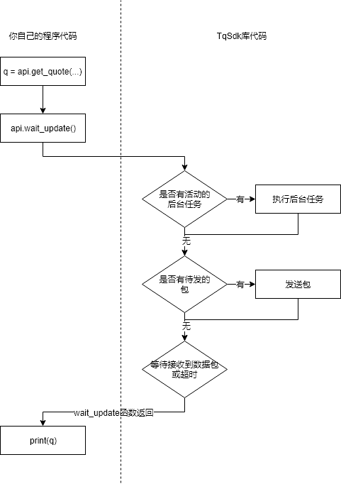

.. _framework:

策略程序结构
====================================================

TqApi
----------------------------------------------------
:py:class:`tqsdk.TqApi` 是 TqSdk 的核心类. 通常情况下, 每个使用了 TqSdk 的程序都应该包括 **一个** TqApi 实例::

    api = TqApi(auth=TqAuth("快期账户", "账户密码"))

TqApi 实例负责:

* 建立websocket连接到服务器.
* 在内存中建立数据存储区, 接收行情和交易业务数据包, 并自动维护数据更新.
* 发出交易指令.
* 管理协程任务.
* 执行策略回测.

TqApi 创建时, 需要提供一个account参数. 它可以是:

* 一个 :py:class:`tqsdk.TqAccount` 实例: 使用实盘帐号, 直连行情和交易服务器, 需提供期货公司/帐号/密码
* 一个 :py:class:`tqsdk.TqSim` 实例: 使用 Api 自带的模拟功能, 直连行情服务器接收行情数据
* 如果未提供 account 参数, 或者 account == None, 则会自动创建并使用一个 :py:class:`tqsdk.TqSim` 实例

此外还需要传入用户的快期账户，参见 :ref:`shinny_account`

TqApi 的其它构建参数请见 :py:class:`tqsdk.TqApi`

关键函数: wait_update
----------------------------------------------------
:py:meth:`~tqsdk.TqApi.wait_update` 是 TqApi 中最重要的一个函数. 每次调用 :py:meth:`~tqsdk.TqApi.wait_update` 函数时将发生这些事:

* 实际发出网络数据包. 例如, 策略程序用 insert_order 函数下单, 实际的报单指令是在 insert_order 后调用 :py:meth:`~tqsdk.TqApi.wait_update` 时发出的
* 让正在运行中的后台任务获得动作机会．例如, 策略程序中创建了一个后台调仓任务, 这个任务只会在 :py:meth:`~tqsdk.TqApi.wait_update` 时发出交易指令
* 尝试从服务器接收一个数据包, 并用收到的数据包更新内存中的业务数据截面.
* 如果没有收到数据包，则挂起等待，如果要避免长时间挂起，可通过设置 :py:meth:`~tqsdk.TqApi.wait_update` 中的deadline参数，设置等待截止时间

因此, TqSdk 要求策略程序必须反复调用 :py:meth:`~tqsdk.TqApi.wait_update`, 才能保证整个程序正常运行. 一般会将 :py:meth:`~tqsdk.TqApi.wait_update` 放在一个循环中反复调用
（注: 若跳出循环，程序结束前需调用 api.close() 释放资源)::

    while True:             #一个循环
        api.wait_update()   #总是调用 wait_update, 当数据有更新时 wait_update 函数返回, 执行下一句
        do_some_thing()     #每当数据有变更时, 执行自己的代码, 然后循环回去再做下一次 wait_update

    #注：若跳出循环并运行到程序末尾，在结束运行前需调用 api.close() 函数以关闭天勤接口实例并释放相应资源，请见下文 “一个典型程序的结构”

内存数据及数据更新
----------------------------------------------------
TqApi 实例内存中保存了一份完整业务数据截面, 包括行情/K线和交易账户数据. 这些数据可以通过 :py:class:`~tqsdk.TqApi` 提供的数据引用函数获取，以获取资金账户为例::

    account = api.get_account()  # 获取账户信息引用
    print(account.balance)    # 显示账户信息

值得注意的是, get_account 返回资金账户的一个动态引用, 而不是具体的数值.
因此只需调用一次 get_account 得到 account 引用，之后任何时刻都可以使用 account.balance 获得最新的账户权益.
当 :py:meth:`~tqsdk.TqApi.wait_update` 函数返回时业务截面即完成了从上一个时间截面推进到下一个时间截面。

:py:meth:`~tqsdk.TqApi.wait_update` 会在任何数据更新时返回. 如果想知道 :py:meth:`~tqsdk.TqApi.wait_update` 到底更新了哪些业务数据可以调用 :py:meth:`~tqsdk.TqApi.is_changing` 函数判断感兴趣的业务对象是否有更新，例如::

    if api.is_changing(account):
        print("账户变化")                    #任何资金账户中任意信息变化的时候打出 "账户变化"

    if api.is_changing(account, "balance"):
        print("账户权益变化")                    #只有资金账户中的权益值变化的时候打出 "账户权益变化"

**建议跨交易日重启代码** ,否则可能导致:
    1. 合约信息不能及时更新（如：有新上市的合约,保持登录的第二个交易日就没有这个合约信息)
    2. 前一交易日的未成交委托单没有删除\更新
    3. 如果使用了交易辅助工具 TargetPosTask 并且收盘后有挂单，导致 TargetPosTask 在下一交易日无法继续执行
    4. 其他未知问题.

一个典型程序的结构
----------------------------------------------------
以一个通常的策略流程为例：判断开仓条件，开仓，判断平仓条件，平仓，使用 TqSdk 写出的代码::

    from tqsdk import TqApi, TqAuth, TqSim, TargetPosTask

    api = TqApi(auth=TqAuth("快期账户", "账户密码"))
    klines = api.get_kline_serial("SHFE.rb1901", 60)
    position = api.get_position("SHFE.rb1901")
    target_pos = TargetPosTask(api, "SHFE.rb1901")

    while True:                                                 #判断开仓条件的主循环
        api.wait_update()                                       #等待业务数据更新
        if 开仓条件:
            target_pos.set_target_volume(1)                     #如果触发了，则通过 target_pos 将 SHFE.rb1901 的目标持仓设置为多头 1 手，具体的调仓工作则由 target_pos 在后台完成
            break                                               #跳出开仓循环，进入下面的平仓循环

    while True:                                                 #判断平仓条件的主循环
        api.wait_update()
        if 平仓条件:
            target_pos.set_target_volume(0)                     #如果触发了，则通过 target_pos 将 SHFE.rb1901 的目标持仓设置为0手(即空仓)
        if position.pos == 0:                                   #如果已经将仓位平掉则跳出循环
            break
    api.close()                                                 #注意：程序结束运行前需调用此函数以关闭天勤接口实例并释放相应资源，同时此函数会包含发送最后一次wait_update信息传输
    #至此就完成一次完整的开平仓流程，如果平仓后还需再判断开仓条件可以把开仓循环和平仓循环再套到一个大循环中。

