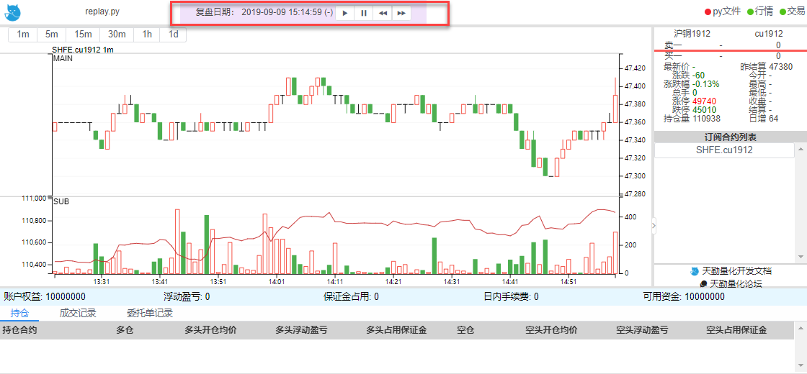

.. _replay:

策略程序复盘
=================================================

执行策略复盘
-------------------------------------------------
除了传统的回测模式以外，TqSdk 提供独具特色的复盘模式，它与回测模式有以下区别

1.复盘模式为时间驱动，回测模式为事件驱动

复盘模式下，你可以指定任意一天交易日，后端行情服务器会传输用户订阅合约的当天的所有历史行情数据，重演当天行情，而在回测模式下，我们采用 :ref:`backtest_rule` ,根据用户订阅的合约周期数据来进行推送

因此在复盘模式下K线更新和实盘一模一样，而回测模式下就算订阅了 Tick 数据，回测中任意周期 K 线最后一根的 close 和其他数据也不会随着 Tick 更新而更新，而是随着K线频率生成和结束时更新一次

2.复盘和回测的行情速度

因为两者的驱动机制不同，回测会更快，但是我们在复盘模式下也提供行情速度调节功能，可以结合 :ref:`web_gui_replay` 来实现

3.复盘目前只支持单日复盘

因为复盘提供对应合约全部的当日历史行情数据，对后端服务器会有较大压力，目前只支持复盘模式下选择单日进行复盘

使用 TqSdk 编写的策略程序，不需要修改策略代码，只需要在创建 api 实例时给 backtest 参数传入 :py:class:`~tqsdk.backtest.TqReplay` 指定复盘日期, 策略就会进入复盘模式::

  from datetime import date
  from tqsdk import TqApi, TqReplay

  api = TqApi(backtest = TqReplay(date(2019,12,23)), auth=TqAuth("快期账户", "账户密码"))

此外我们认为复盘模式结合图形化界面会有更好的体验，可以参考 :ref:`web_gui` 

同时在图形化界面下，你可以通过点击复盘速度控制按钮对复盘行情速度进行控制

**使用复盘模式时需要注意：**

1.指定复盘日期需要有行情，否则提示无法创建复盘服务器

2.订阅合约在复盘日期时已经上市或还未下市

