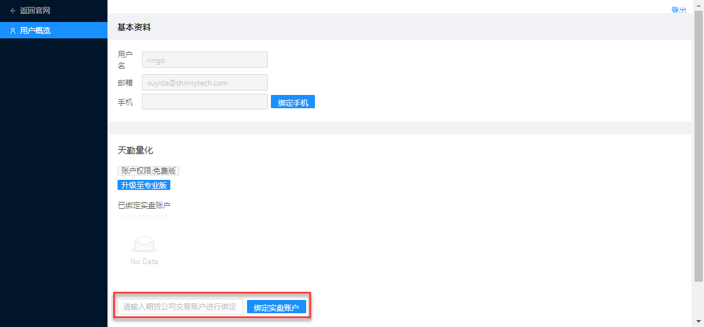

.. _trade:

账户与交易
====================================================
快期账户和实盘账户
----------------------------------------------------
在使用 TqSdk 之前，用户需要先注册自己的 **快期账户** ，传入快期账户是使用任何 TqSdk 程序的前提

点击  `注册快期账户 <https://account.shinnytech.com/>`_ ::

    from tqsdk import TqApi, TqAuth
    api = TqApi(auth=TqAuth("快期账户", "账户密码"))

对于 TqSdk 免费版，每个快期账户支持最多绑定一个实盘账户，并且快期账户会在用户第一次使用实盘账户时自动进行绑定(自动绑定功能需要 TqSdk 版本> 1.8.3)::

    from tqsdk import TqApi, TqAuth
    api = TqApi(auth=TqAuth("快期账户", "账户密码"))

如果需要注册快期账户或者修改您的快期账户绑定的实盘账户，请点击 `登录用户管理中心 <https://www.shinnytech.com/register-intro/>`_ ，登录成功后显示如下

在下方红框处,用户可以自行解绑/绑定实盘账户，其中解绑操作每天限定一次

如果需要让您的快期账户支持更多的实盘账户，可以购买或申请试用我们的 `天勤量化专业版 <https://www.shinnytech.com/tqsdk-buy/>`_

设定实盘交易账户
----------------------------------------------------
TqSdk 要求在创建 TqApi 时指定交易账户。一旦TqApi创建成功，后续所有通过TqApi发出的交易指令均在此账户中进行.

要使用实盘交易账户, 请使用 :py:class:`~tqsdk.TqAccount` (注：使用前请先 import TqAccount)::

    from tqsdk import TqAccount, TqApi, TqAuth

    api = TqApi(TqAccount("H海通期货", "320102", "123456"), auth=TqAuth("快期账户", "账户密码"))

:py:class:`~tqsdk.TqAccount` 的三个参数分别为 <期货公司名>, <用户名> 和 <密码> (期货公司名前需加大写首字母). 目前TqSdk支持的期货公司列表请参见: `TqSdk支持的期货公司列表 <https://www.shinnytech.com/blog/tq-support-broker/>`_

TqApi 创建成功即代表相应账户已登录成功. 如果在60秒内无法完成登录, 会抛出超时异常, 用户代码可以此判定登录失败::

    try:
        api = TqApi(TqAccount("H海通期货", "320102", "123456"), auth=TqAuth("快期账户", "账户密码"))
    except Exception as e:
        print("行情服务连不上, 或者期货公司服务器关了, 或者账号密码错了, 总之就是有问题")

设定快期模拟交易账户
----------------------------------------------------
如果您需要使用快期模拟账户进行测试，只需在创建TqApi时传入一个 :py:class:`~tqsdk.TqKq` 的实例，同时需要传入快期账户 :ref:`sim_trading`。

此账户类型与快期 APP 、天勤官网论坛、快期专业版使用相同的模拟账户系统::

    from tqsdk import TqApi, TqAuth, TqKq

    api = TqApi(TqKq(), auth=TqAuth("快期账户", "账户密码"))

设定模拟交易账户
----------------------------------------------------
如果您需要使用模拟账户进行测试，只需在创建TqApi时传入一个 :py:class:`~tqsdk.TqSim` 的实例（不填写参数则默认为 TqSim() 模拟账号）::

    api = TqApi(TqSim()，auth=TqAuth("快期账户", "账户密码"))

如果需要使用能保存账户资金及持仓信息的模拟账户，请使用 "快期模拟" 账号, 账户申请及使用方法请参考 :ref:`sim_trading` 部分内容。

获取账户情况
----------------------------------------------------
TqApi 提供以下函数来获取交易账户相关信息:

* :py:meth:`~tqsdk.TqApi.get_account` - 获取账户资金情况
* :py:meth:`~tqsdk.TqApi.get_position` - 获取持仓情况
* :py:meth:`~tqsdk.TqApi.get_order` - 获取委托单

以上函数返回的都是dict, 并会在 wait_update 时更新

交易指令
----------------------------------------------------
要在交易账户中发出一个委托单, 使用 :py:meth:`~tqsdk.TqApi.insert_order` 函数::

    order = api.insert_order(symbol="SHFE.rb1901", direction="BUY", offset="OPEN", limit_price=4310, volume=2)
    print(order)

这个函数调用后会立即返回一个指向此委托单的对象引用, 使用方法与dict一致, 内容如下::

    {
        "order_id": "",  # "123" (委托单ID, 对于一个用户的所有委托单，这个ID都是不重复的)
        "exchange_order_id": "",  # "1928341" (交易所单号)
        "exchange_id": "",  # "SHFE" (交易所)
        "instrument_id": "",  # "rb1901" (交易所内的合约代码)
        "direction": "",  # "BUY" (下单方向, BUY=买, SELL=卖)
        "offset": "",  # "OPEN" (开平标志, OPEN=开仓, CLOSE=平仓, CLOSETODAY=平今)
        "volume_orign": 0,  # 10 (总报单手数)
        "volume_left": 0,  # 5 (未成交手数)
        "limit_price": float("nan"),  # 4500.0 (委托价格, 仅当 price_type = LIMIT 时有效)
        "price_type": "",  # "LIMIT" (价格类型, ANY=市价, LIMIT=限价)
        "volume_condition": "",  # "ANY" (手数条件, ANY=任何数量, MIN=最小数量, ALL=全部数量)
        "time_condition": "",  # "GFD" (时间条件, IOC=立即完成，否则撤销, GFS=本节有效, GFD=当日有效, GTC=撤销前有效, GFA=集合竞价有效)
        "insert_date_time": 0,  # 1501074872000000000 (下单时间(按北京时间)，自unix epoch(1970-01-01 00:00:00 GMT)以来的纳秒数)
        "status": "",  # "ALIVE" (委托单状态, ALIVE=有效, FINISHED=已完)
        "last_msg": "",  # "报单成功" (委托单状态信息)
    }

与其它所有数据一样, 委托单的信息也会在 api.wait_update() 时被自动更新::

    order = api.insert_order(symbol="SHFE.rb1901", direction="BUY", offset="OPEN", limit_price=4310,volume=2)
    while order.status != "FINISHED":
        api.wait_update()
        print("委托单状态: %s, 未成交手数: %d 手" % (order.status, order.volume_left))

要撤销一个委托单, 使用 :py:meth:`~tqsdk.TqApi.cancel_order` 函数::

    api.cancel_order(order)

* **除 insert_order 和 cancel_order 外, TqSdk 提供了一些更强的交易辅助工具比如** :py:class:`~tqsdk.TargetPosTask`. **使用这些工具, 可以简化交易逻辑的编码工作.**

.. _broker_list:

TqSdk支持的期货公司列表
-----------------------------------------------------
请点击查看: `TqSdk支持的期货公司列表 <https://www.shinnytech.com/blog/tq-support-broker/>`_

