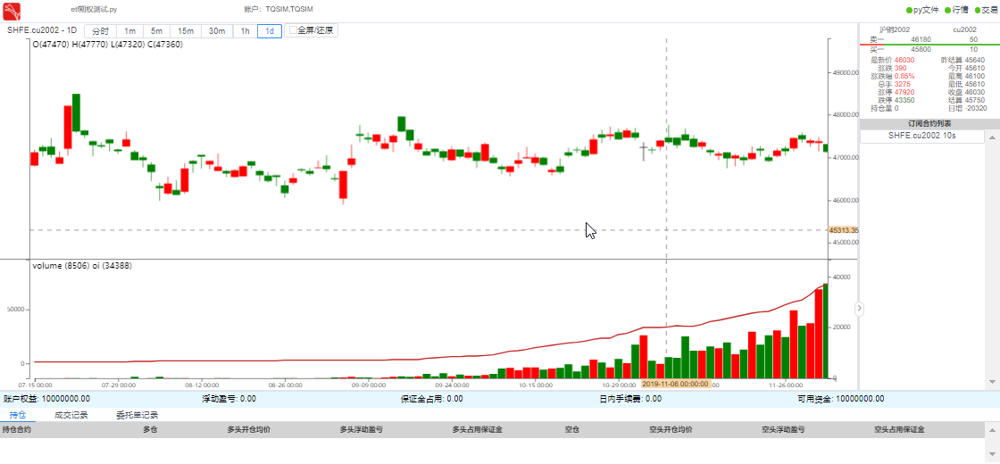
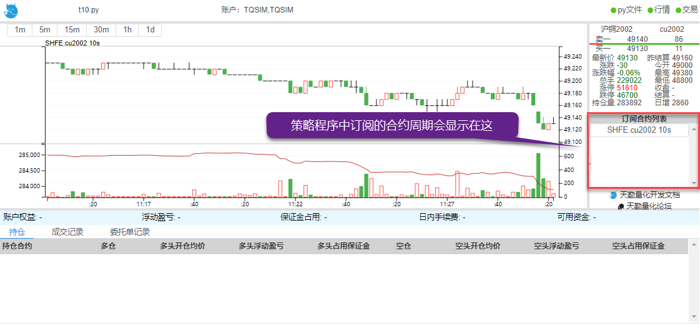
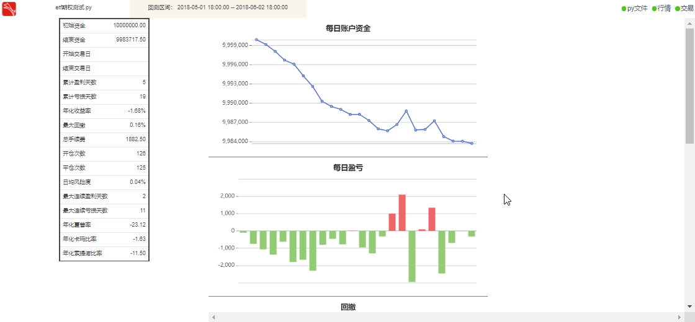

.. _web_gui:

策略程序图形化界面
====================================================

要在 TqSdk 中实现图形化界面非常简单，在 :py:class:`~tqsdk.TqApi` 中传入参数 web_gui = True即可，一套方案满足实盘/回测需求

对于需要固定web_gui网址的同学，可以传入本机IP端口 web_gui = "http://192.168.143.0:9876"（需填写本机IP端口） 来进行固定网址

实盘情况下的图形化界面
----------------------------------------------------
实盘下的示例代码::

        # 引入TqSdk模块
        from tqsdk import TqApi, TqAuth
        # 创建api实例，设置web_gui=True生成图形化界面
        api = TqApi(web_gui=True, auth=TqAuth("快期账户", "账户密码"))
        # 订阅 cu2002 合约的10秒线
        klines = api.get_kline_serial("SHFE.cu2002", 10)
        while True:
            # 通过wait_update刷新数据
            api.wait_update()

当你运行该程序后，预期会显示如下两条信息::

        2019-12-13 10:45:26,468 - INFO - 您可以访问 http://127.0.0.1:62964 查看策略绘制出的 K 线图形。
        2019-12-13 10:45:27,422 - INFO - 通知: 与 wss://openmd.shinnytech.com/t/md/front/mobile 的网络连接已建立

点击访问地址后，显示网址效果如下:

回测情况下的图形化界面
----------------------------------------------------
回测情况下，设置完回测区间参数后传入web_gui=True，也可以用同样的方法来生成图形化地址::

        from datetime import date
        from tqsdk import TqApi, TqAuth, TqBacktest, TargetPosTask
        # 在创建 api 实例时传入 TqBacktest 就会进入回测模式,设置web_gui=True开启图形化界面
        api = TqApi(backtest=TqBacktest(start_dt=date(2018, 5, 2), end_dt=date(2018, 6, 2)),web_gui=True, auth=TqAuth("快期账户", "账户密码"))
        # 获得 m1901 5分钟K线的引用
        klines = api.get_kline_serial("DCE.m1901", 5 * 60, data_length=15)
        # 创建 m1901 的目标持仓 task，该 task 负责调整 m1901 的仓位到指定的目标仓位
        target_pos = TargetPosTask(api, "DCE.m1901")
        while True:
            api.wait_update()
            if api.is_changing(klines):
                ma = sum(klines.close.iloc[-15:]) / 15
                print("最新价", klines.close.iloc[-1], "MA", ma)
                if klines.close.iloc[-1] > ma:
                    print("最新价大于MA: 目标多头5手")
                    # 设置目标持仓为多头5手
                    target_pos.set_target_volume(5)
                elif klines.close.iloc[-1] < ma:
                    print("最新价小于MA: 目标空仓")
                    # 设置目标持仓为空仓
                    target_pos.set_target_volume(0)

点击访问地址后，显示网址效果如下:

点击完整回测报告，显示更加详细的报告结果:

如何在 TqSdk 中进行回测可以参见 :ref:`backtest` 

.. _web_gui_replay:

